# 1. 下载安装Go语言

## 1.1. 下载地址：https://golang.google.cn/dl/

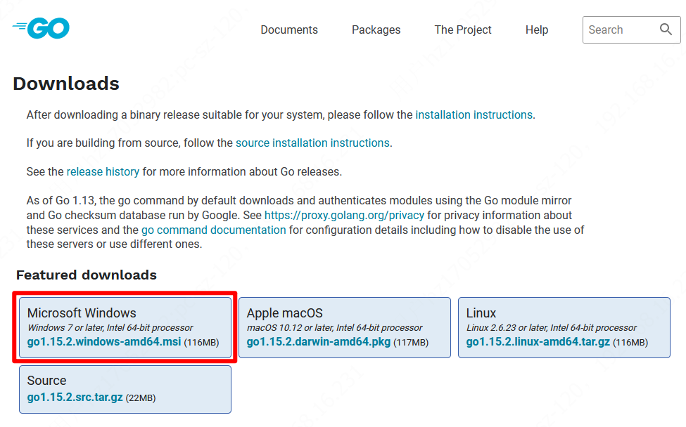

下载完成后，直接双击 msi 文件进行安装

此安装实例以 64位Win10系统安装 Go1.14.1可执行文件版本为例。 
将上一步选好的安装包下载到本地。

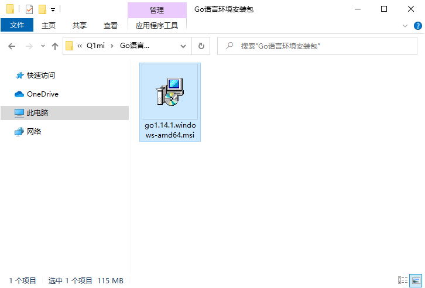


双击下载好的文件，然后按照下图的步骤安装即可。

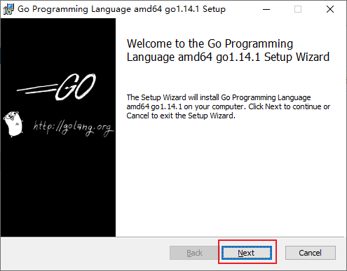
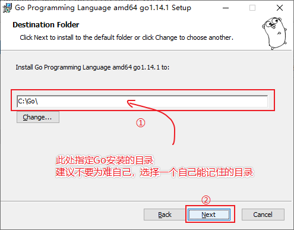

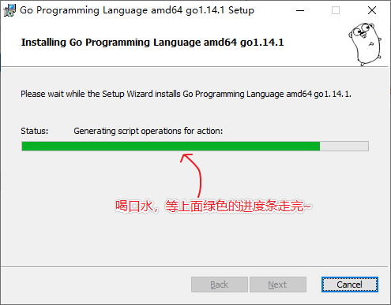
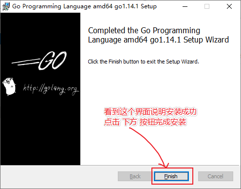
配置系统环境变量
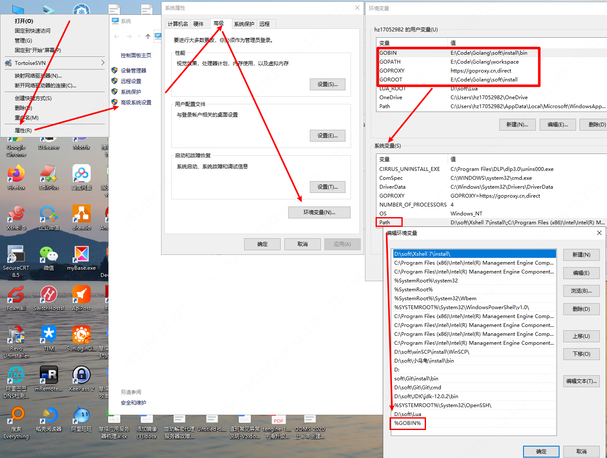


比较重要的是三个变量，变量一定要全部大写：
GOPATH
GOROOT
GOBIN

GOROOT ：在GO语言中表示的是 Go语言编译、工具、标准库等的安装路径，通过它可以告诉系统你的 go.exe 是放在哪里，不设置的话，你后面执行 go get 、go install 的时候，系统就不认识它了。

而 GOPATH环境变量则表示 Go的工作目录，这个目录指定了需要从哪个地方寻找GO的包、可执行程序等，这个目录可以是多个目录表示。这里我设置成我的工作空间（目录你可以自己定） ：E:\Code\Golang\workspace，如果不设置的话 ，默认是在你的用户目录下的 go 文件夹。
这时要再说一点，GO 项目中，一般来说它的工作目录结构是这样的：

bin目录：包含了可执行程序，注意是可执行的，不需要解释执行。
pkg目录：包含了使用的包或者说库。
src目录：里面包含了go的代码源文件，其中仍按包的不同进行组织。

依赖包下载源地址修改为国内地址：
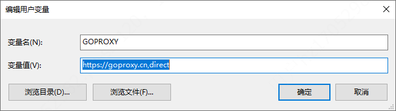

GOPROXY=https://goproxy.cn,direct


## 1.2. 、VScode配置Golang开发环境


安装中文简体插件 

点击左侧菜单栏最后一项  管理扩展，在搜索框中输入chinese ，选中结果列表第一项，点击install安装。 
安装完毕后右下角会提示重启VS Code，重启之后你的VS Code就显示中文啦！ 
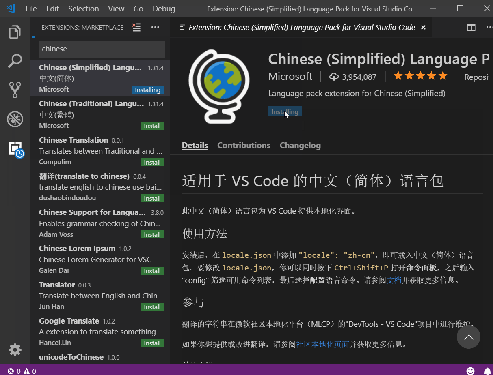

VSCode主界面介绍： 
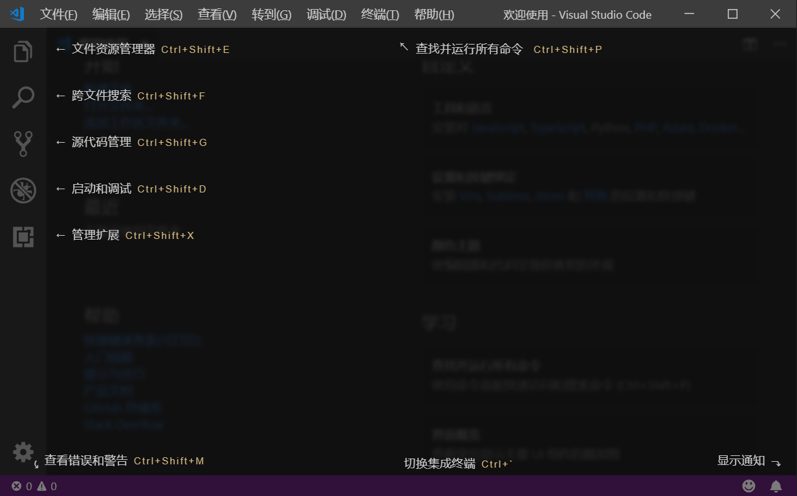


### 1.2.1. 安装go扩展 
现在我们要为我们的VS Code编辑器安装Go扩展插件，让它支持Go语言开发

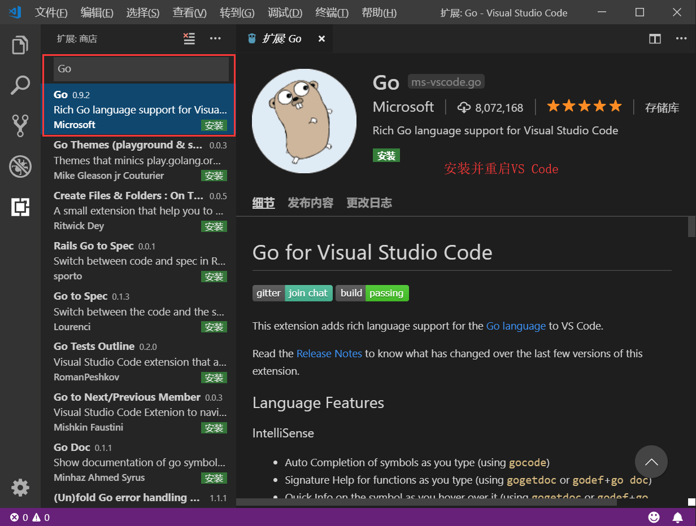


### 1.2.2. 开启代码提示

在 VS Code 中，使用快捷键：`ctrl+shift+P`，然后键入：`go:install/update tools`，将所有 18 个插件都勾选上，然后点击 OK 即开始安装。
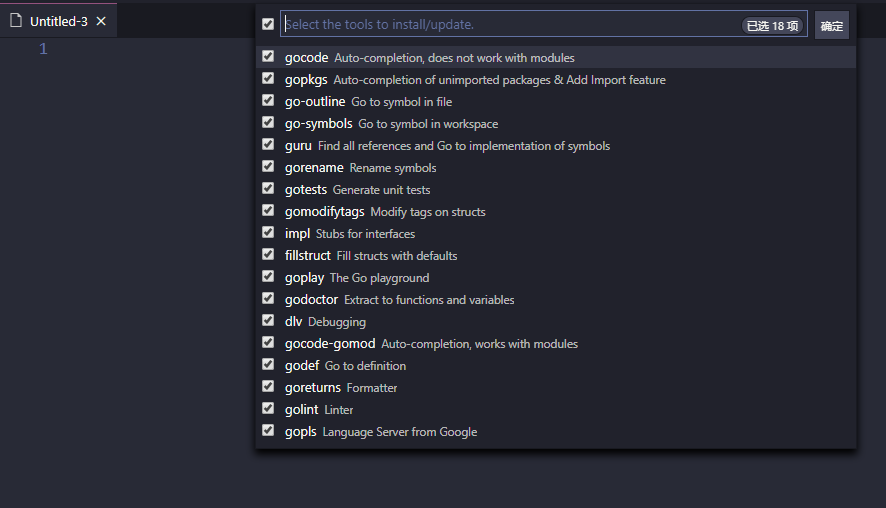

```
Installing 18 tools at /Users/maiyang/develop/goworkspace//bin
  gocode
  gopkgs
  go-outline
  go-symbols
  guru
  gorename
  dlv
  godef
  godoc
  goreturns
  golint
  gotests
  gomodifytags
  impl
  fillstruct
  goplay

Installing github.com/mdempsky/gocode SUCCEEDED
Installing github.com/uudashr/gopkgs/cmd/gopkgs SUCCEEDED
Installing github.com/ramya-rao-a/go-outline SUCCEEDED
Installing github.com/acroca/go-symbols SUCCEEDED
Installing golang.org/x/tools/cmd/guru SUCCEEDED
Installing golang.org/x/tools/cmd/gorename SUCCEEDED
Installing github.com/derekparker/delve/cmd/dlv SUCCEEDED
Installing github.com/rogpeppe/godef SUCCEEDED
Installing golang.org/x/tools/cmd/godoc SUCCEEDED
Installing github.com/sqs/goreturns SUCCEEDED
Installing github.com/golang/lint/golint SUCCEEDED
Installing github.com/cweill/gotests/... SUCCEEDED
Installing github.com/fatih/gomodifytags SUCCEEDED
Installing github.com/josharian/impl SUCCEEDED
Installing github.com/davidrjenni/reftools/cmd/fillstruct SUCCEEDED
Installing github.com/haya14busa/goplay/cmd/goplay SUCCEEDED

All tools successfully installed. You're ready to Go :).
```
修改默认配置
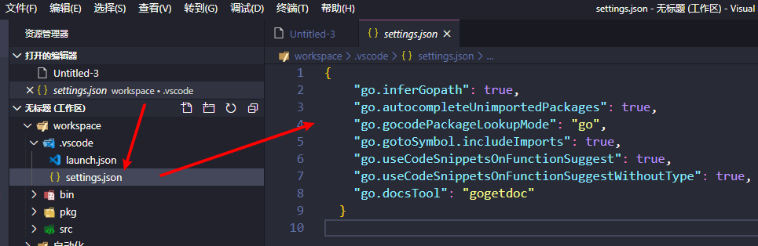

```
{
    "go.inferGopath": true,
    "go.autocompleteUnimportedPackages": true,
    "go.gocodePackageLookupMode": "go",
    "go.gotoSymbol.includeImports": true,
    "go.useCodeSnippetsOnFunctionSuggest": true,
    "go.useCodeSnippetsOnFunctionSuggestWithoutType": true,
    "go.docsTool": "gogetdoc"
}
```

到这时环境配置完成，编写 HelloWorld，并运行查看输出，一切完成。
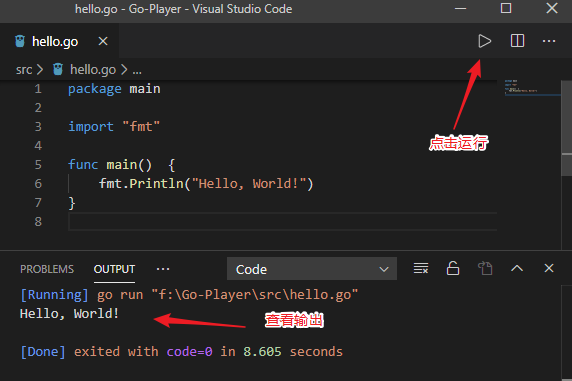

### 1.2.3. 配置环境变量
当你在终端使用 go env 的时候，会打印出go 相关的所有环境变量
```
PS E:\Code\Golang\workspace> go env
set GO111MODULE=auto
set GOARCH=amd64
set GOBIN=E:\Code\Golang\soft\install\bin
set GOCACHE=C:\Users\hz17052982\AppData\Local\go-build
set GOENV=C:\Users\hz17052982\AppData\Roaming\go\env  
set GOEXE=.exe
set GOFLAGS=
set GOHOSTARCH=amd64
set GOHOSTOS=windows
set GOINSECURE=
set GOMODCACHE=E:\Code\Golang\workspace\pkg\mod
set GONOPROXY=
set GONOSUMDB=
set GOOS=windows
set GOPATH=E:\Code\Golang\workspace
set GOPRIVATE=
set GOPROXY=https://goproxy.cn,direct
set GOROOT=E:\Code\Golang\soft\install
set GOSUMDB=sum.golang.org
set GOTMPDIR=
set GOTOOLDIR=E:\Code\Golang\soft\install\pkg\tool\windows_amd64
set GCCGO=gccgo
set AR=ar
set CC=gcc
set CXX=g++
set CGO_ENABLED=1
set GOMOD=
set CGO_CFLAGS=-g -O2
set CGO_CPPFLAGS=
set CGO_CXXFLAGS=-g -O2
set CGO_FFLAGS=-g -O2
set CGO_LDFLAGS=-g -O2
set PKG_CONFIG=pkg-config
set GOGCCFLAGS=-m64 -mthreads -fno-caret-diagnostics -Qunused-arguments -fmessage-length=0 -fdebug-prefix-map=C:\Users\HZ1705~1\AppData\Local\Temp\go-build038650710=/tmp/go-build -gno-record-gcc-switches
PS E:\Code\Golang\workspace>
```