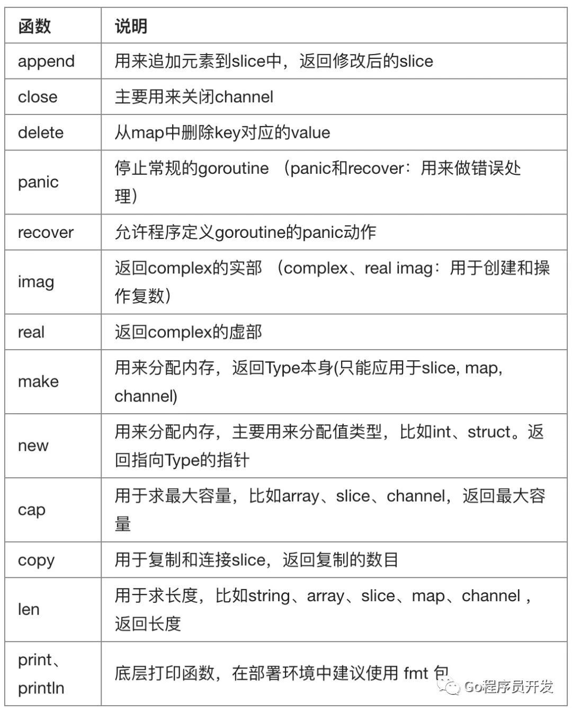

# 1. 2、变量与常量
变量和常量是编程中必不可少的部分，也是很好理解的一部分。 
## 标识符与关键字

### 标识符

在编程语言中标识符就是程序员定义的具有特殊意义的词，比如变量名、常量名、函数名等等。 

Go语言中标识符由字母数字和 _ (下划线）组成，并且只能以字母和 _ 开头。 举几个例子：abc, _, _123, a123。 

#### 关键字 
关键字是指编程语言中预先定义好的具有特殊含义的标识符。 关键字和保留字都不建议用作变量名。 

Go语言中有25个关键字： 
```
    break        default      func         interface    select
    case         defer        go           map          struct
    chan         else         goto         package      switch
    const        fallthrough  if           range        type
    continue     for          import       return       var
```
此外，Go语言中还有37个保留字。 
```
    内建常量:    true  false  iota  nil

    内建类型:    int  int8  int16  int32  int64
                  uint  uint8  uint16  uint32  uint64  uintptr
                  float32  float64  complex128  complex64
                  bool  byte  rune  string  error

    内建函数:   make  len  cap  new  append  copy  close  delete
                 complex  real  imag
                 panic  recover
```

**函数说明：**



## 变量 

### 变量的来历 

程序运行过程中的数据都是保存在内存中，我们想要在代码中操作某个数据时就需要去内存上找到这个变量，但是如果我们直接在代码中通过内存地址去操作变量的话，代码的可读性会非常差而且还容易出错，所以我们就利用变量将这个数据的内存地址保存起来，以后直接通过这个变量就能找到内存上对应的数据了。

Go 语言是静态类型语言，由于编译时，编译器会检查变量的类型，所以要求所有的变量都要有明确的类型。
变量在使用前，需要先声明。声明类型，就约定了你这个变量只能赋该类型的值。


#### 变量类型 
变量（Variable）的功能是存储数据。不同的变量保存的数据类型可能会不一样。经过半个多世纪的发展，编程语言已经基本形成了一套固定的类型，常见变量的数据类型有：整型、浮点型、布尔型等．

#### 变量声明
Go语言中的每一个变量都有自己的类型，并且变量必须经过声明才能开始使用。同一作用域内不支持重复声明。
声明一般有以下五种方法，其中前面两种同样也可用于定义常量，只需把关键字 var 变成 const 即可。

 
#### 变量的初始化
Go语言在声明变量的时候，会自动对变量对应的内存区域进行初始化操作。每个变量会被初始化成其类型的默认值，例如： 整型和浮点型变量的默认值为0。 字符串变量的默认值为空字符串。 布尔型变量默认为false。 切片、函数、指针变量的默认为nil。 
当然我们也可在声明变量的时候为其指定初始值。变量初始化的标准格式如下： 
var 变量名 类型 = 表达式
 

##### 第一种、标准声明 
一行声明一个变量

Go语言的变量声明格式为：
```
var <name> <type> 
var 变量名 变量类型
```
其中 var 是关键字（固定不变），name 是变量名，type 是类型。
变量声明以关键字var开头，变量类型放在变量的后面，行尾无需分号。 举个例子： 
```
var name string
var age int
var isOk bool
```
使用 var ，虽然只指定了类型，但是 Go 会对其进行隐式初始化，比如 string 类型就初始化为空字符串，int 类型就初始化为0，float 就初始化为 0.0，bool类型就初始化为false，指针类型就初始化为 nil，若想在声明过程，顺便也初始化，可以这样写
```
var name sting = "哈哈哈哈"
```
在 Go 文件中的完整代码如下
```
package main

import "fmt"

func main()  {
    var name string = "哈哈哈哈"
    fmt.Println(name)
}
```

从右值（等号右边的值，rvalue）来看，明显是个 string 类型（这里要注意，在 Go 中双引号和单引号是不一样的，这里要一定要使用双引号，表示字符串，而在单引号表示rune 类型的字符），因此也可以将其简化为
```
var name = "哈哈哈哈"
```

若右值带有小数点，在不指定类型的情况下，编译器会将这个变量声明为 float64，但是很多情况下，我们并不需要这么高的精度（占用的内存空间更大）
这种情况下，推荐指定类型。
```
var rate float32 = 0.89
```

##### 第二种、批量声明 
每声明一个变量就需要写var关键字会比较繁琐，go语言中声明多个变量除了可以按照上面写成多行之外，还可以写成下面这样： 
```
var (
    a string
    b int
    c bool
    d float32
)
```
或者一次初始化多个变量 
```
var name, age = "Q1mi", 20
```
这种方法，也经常用于变量的交换
```
var a int = 100
var b int = 200
b, a = a, b
```
##### 第三种、类型推导，短变量声明 
有时候我们会将变量的类型省略，这个时候编译器会根据等号右边的值来推导变量的类型完成初始化。 
var name = "Q1mi"
var age = 18

在函数内部，可以使用更简略的 := 方式声明并初始化变量。 推导声明写法或者短类型声明法：编译器会自动根据右值类型推断出左值的对应类型。可以声明一个变量，并对其进行（显式）初始化,但这种方法有个限制就是，只能用于函数内部。`:=`只有对已经在同级词法域声明过的变量才和赋值操作语句等价，如果变量是在外部词法域声明的，那么`:=`将会在当前词法域重新声明一个新的变量
```
package main

import (
	"fmt"
)
// 全局变量m
var m = 100

func main() {
	n := 10
	m := 200 // 此处声明局部变量m，等价于  var m int = 200  等价于 var m = 200
	fmt.Println(m, n)
}
```
##### 第四种、匿名变量 

匿名变量，也称作占位符，或者空白标识符，用下划线表示。

匿名变量，优点有三：
不分配内存，不占用内存空间
不需要你为命名无用的变量名而纠结
匿名变量之间不存在重复声明，多次声明不会有任何问题

通常我们用匿名接收必须接收，但是又不会用到的值。
```
func GetData() (int, int) {
    return 100, 200
}
func main(){
    a, _ := GetData()
    _, b := GetData()
    fmt.Println(a, b)
}
```
在使用多重赋值时，如果想要忽略某个值，可以使用匿名变量`（anonymous variable）`。 匿名变量用一个下划线_表示，例如：
```
func foo() (int, string) {
	return 10, "Q1mi"
}
func main() {
	x, _ := foo()
	_, y := foo()
	fmt.Println("x=", x)
	fmt.Println("y=", y)
}
```
注意事项： 
函数外的每个语句都必须以关键字开始`（var、const、func）`等
`:=`不能使用在函数外。
`_`多用于占位，表示忽略值。 


##### 第五种：new 函数声明一个指针变量

变量分为两种 普通变量 和 指针变量
普通变量，存放的是数据本身，而指针变量存放的是数据的地址。
如下代码，age 是一个普通变量，存放的内容是 28，而 ptr 是 存放变量age值的内存地址：0xc000010098
```
package main

import "fmt"

func main()  {
    var age int = 28
    var ptr = &age  // &后面接变量名，表示取出该变量的内存地址
    fmt.Println("age: ", age)
    fmt.Println("ptr: ", ptr)
}
```
输出
```
age:  28
ptr:  0xc000010098
```
而这里要说的 `new 函数`，是 Go 里的一个内建函数。
使用表达式 `new(Type) `将创建一个Type类型的匿名变量，初始化为Type类型的零值，然后返回变量地址，返回的指针类型为*Type。
```
package main

import "fmt"

func main()  {
    ptr := new(int)
    fmt.Println("ptr address: ", ptr)
    fmt.Println("ptr value: ", *ptr)  // *后面接指针变量，表示从内存地址中取出值
}
```
输出
```
ptr address:  0xc000010098
ptr value:  0
```
用new创建变量和普通变量声明语句方式创建变量没有什么区别，除了不需要声明一个临时变量的名字外，我们还可以在表达式中使用new(Type)。换言之，new函数类似是一种语法糖，而不是一个新的基础概念。
如下两种写法，可以说是等价的
```
// 使用 new
func newInt() *int {
    return new(int)
}
```
```
// 使用传统的方式
func newInt() *int {
    var dummy int
    return &dummy
}
```
以上不管哪种方法，变量/常量都只能声明一次，声明多次，编译就会报错。


## 常量 
相对于变量，常量是恒定不变的值，多用于定义程序运行期间不会改变的那些值。 常量的声明和变量声明非常类似，只是把var换成了const，常量在定义的时候必须赋值。 
```
const pi = 3.1415
const e = 2.7182
```
声明了pi和e这两个常量之后，在整个程序运行期间它们的值都不能再发生变化了。 
多个常量也可以一起声明： 
```
const (
    pi = 3.1415
    e = 2.7182
)
```
const同时声明多个常量时，如果省略了值则表示和上面一行的值相同。 例如： 
```
const (
    n1 = 100
    n2
    n3
)
```
上面示例中，常量n1、n2、n3的值都是100。
 
### iota 

iota是go语言的常量计数器，只能在常量的表达式中使用。 
iota在const关键字出现时将被重置为0。const中每新增一行常量声明将使iota递增1(iota可理解为const语句块中的行索引)。
使用iota能简化定义，在定义枚举时很有用。 
举个例子： 
```
const (
		n1 = iota //0
		n2        //1
		n3        //2
		n4        //3
	)
``` 
几个常见的iota示例: 
使用_跳过某些值 
```
const (
		n1 = iota //0
		n2        //1
		_
		n4        //3
	)
```
iota声明中间插队 
```
const (
		n1 = iota //0
		n2 = 100  //100
		n3 = iota //2
		n4        //3
	)
	const n5 = iota //0
``` 
定义数量级 （这里的<<表示左移操作，1<<10表示将1的二进制表示向左移10位，也就是由1变成了10000000000，也就是十进制的1024。同理2<<2表示将2的二进制表示向左移2位，也就是由10变成了1000，也就是十进制的8。） 
```
const (
		_  = iota
		KB = 1 << (10 * iota)
		MB = 1 << (10 * iota)
		GB = 1 << (10 * iota)
		TB = 1 << (10 * iota)
		PB = 1 << (10 * iota)
     )
``` 
多个iota定义在一行 
```
const (
		a, b = iota + 1, iota + 2 //1,2
		c, d                      //2,3
		e, f                      //3,4
)
```

```
package main

import (
	"fmt"
)

const (
	x = iota // x == 0
	y = iota // y == 1
	z = iota // z == 2
	w        // 常量声明省略值时，默认和之前一个值的字面相同。这里隐式地说w = iota，因此w == 3。其实上面y和z可同样不用"= iota"
)

const v = iota // 每遇到一个const关键字，iota就会重置，此时v == 0

const (
	h, i, j = iota, iota, iota //h=0,i=0,j=0 iota在同一行值相同
)

const (
	a       = iota //a=0
	b       = "B"
	c       = iota             //c=2
	d, e, f = iota, iota, iota //d=3,e=3,f=3
	g       = iota             //g = 4
)

func main() {
	fmt.Println(a, b, c, d, e, f, g, h, i, j, x, y, z, w, v)
}

    除非被显式设置为其它值或iota，每个const分组的第一个常量被默认设置为它的0值，第二及后续的常量被默认设置为它前面那个常量的值，如果前面那个常量的值是iota，则它也被设置为iota。
```