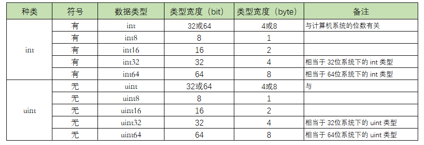

# 1.3、基本数据类型之整形
Go语言中有丰富的数据类型，除了基本的整型、浮点型、布尔型、字符串外，还有数组、切片、结构体、函数、map、通道（channel）等。Go 语言的基本类型和其他语言大同小异。

## 基本数据类型

### 整形

整型分为以下两个大类： 
按长度分为：int8、int16、int32、int64 对应的无符号整型：uint8、uint16、uint32、uint64

其中，uint8就是我们熟知的byte型，int16对应C语言中的short型，int64对应C语言中的long型。



##### 特殊整形：

|  类型   | 符号 |      描述       |
| ------- | --- | -------------- |
| uintptr | 无   | 用于存放一个指针 |

#### 解释这个符号的区别

int 和 uint 的区别就在于一个 u，有 u 说明是无符号，没有 u 代表有符号。 

以 int8 和 uint8 举例，8 代表 8个bit，能表示的数值个数有 2^8 = 256。

uint8 是无符号，能表示的都是正数，0-255，刚好256个数。

int8 是有符号，既可以正数，也可以负数，那怎么办？对半分呗，-128-127，也刚好 256个数。

int8 int16 int32 int64 这几个类型的最后都有一个数值，这表明了它们能表示的数值个数是固定的。

而 int 并没有指定它的位数，说明它的大小，是可以变化的，那根据什么变化呢？
```
    当你在32位的系统下，int 和 uint 都占用 4个字节，也就是32位。

    若你在64位的系统下，int 和 uint 都占用 8个字节，也就是64位。
```
出于这个原因，在某些场景下，应当避免使用 int 和 uint ，而使用更加精确的 int32 和 int64，比如在二进制传输、读写文件的结构描述（为了保持文件的结构不会受到不同编译目标平台字节长度的影响）

###### 注意事项:
获取对象的长度的内建len()函数返回的长度可以根据不同平台的字节长度进行变化。
实际使用中，切片或 map 的元素数量等都可以用int来表示。
在涉及到二进制传输、读写文件的结构描述时，为了保持文件的结构不会受到不同编译目标平台字节长度的影响，不要使用int和 uint。

#### 数字字面量语法
Go1.13版本之后引入了数字字面量语法，这样便于开发者以二进制、八进制或十六进制浮点数的格式定义数字，例如：

`v := 0b00101101`， 代表二进制的 101101，相当于十进制的 45。
`v := 0o377`，代表八进制的 377，相当于十进制的 255。 
`v := 0x1p-2`，代表十六进制的 1 除以 2²，也就是 0.25。

而且还允许我们用` _ `来分隔数字，比如说:
`v := 123_456` 表示 v 的值等于 123456。

我们可以借助fmt函数来将一个整数以不同进制形式展示。

```
package main
 
import "fmt"
 
func main(){
	// 十进制
	var a int = 10
	fmt.Printf("%d \n", a)  // 10
	fmt.Printf("%b \n", a)  // 1010  占位符%b表示二进制
 
	// 八进制  以0开头
	var b int = 077
	fmt.Printf("%o \n", b)  // 77
 
	// 十六进制  以0x开头
	var c int = 0xff
	fmt.Printf("%x \n", c)  // ff
	fmt.Printf("%X \n", c)  // FF
}
```
出于习惯，在初始化数据类型为整型的变量时，我们会使用10进制的表示法，因为它最直观，比如这样，表示整数10.
```
var num int = 10
```

2进制：以`0b`或`0B`为前缀
```
var num01 int = 0b1100
```

8进制：以`0o`或者`0O`为前缀
```
var num02 int = 0o14
```

16进制：以`0x` 为前缀
```
var num03 int = 0xC
```
下面用一段代码分别使用二进制、8进制、16进制来表示 10 进制的数值：12

```
package main

import (
    "fmt"
)

func main() {
    var num01 int = 0b1100
    var num02 int = 0o14
    var num03 int = 0xC

    fmt.Printf("2进制数 %b 表示的是: %d \n", num01, num01)
    fmt.Printf("8进制数 %o 表示的是: %d \n", num02, num02)
    fmt.Printf("16进制数 %X 表示的是: %d \n", num03, num03)
}
```

输出如下：
```
2进制数 1100 表示的是: 12
8进制数 14 表示的是: 12
16进制数 C 表示的是: 12
```

常用进制表示方法：
```
%b    表示为二进制
%c    该值对应的unicode码值
%d    表示为十进制
%o    表示为八进制
%q    该值对应的单引号括起来的go语法字符字面值，必要时会采用安全的转义表示
%x    表示为十六进制，使用a-f
%X    表示为十六进制，使用A-F
%U    表示为Unicode格式：U+1234，等价于"U+%04X"
%E    用科学计数法表示
%f    用浮点数表示
```