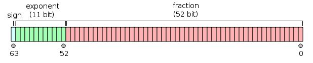

# 1.4、基本数据类型之浮点型

## 浮点型

浮点数类型的值一般由整数部分、小数点`.`和小数部分组成。
其中，整数部分和小数部分均由10进制表示法表示。不过还有另一种表示方法。那就是在其中加入指数部分。指数部分由`E`或`e`以及一个带正负号的10进制数组成。比如，`3.7E-2`表示浮点数`0.037`。又比如，`3.7E+1`表示浮点数`37`。
有时候，浮点数类型值的表示也可以被简化。比如，`37.0`可以被简化为`37`。又比如，`0.037`可以被简化为`.037`。
有一点需要注意，在Go语言里，浮点数的相关部分只能由10进制表示法表示，而不能由8进制表示法或16进制表示法表示。比如，03.7表示的一定是浮点数3.7。

Go语言支持两种浮点型数：`float32`和`float64`。
float32，也即我们常说的单精度，存储占用4个字节，也即`4*8=32`位，其中1位用来符号，8位用来指数，剩下的23位表示尾数


float64，也即我们熟悉的双精度，存储占用8个字节，也即8*8=64位，其中1位用来符号，11位用来指数，剩下的52位表示尾数


### 那么精度是什么意思？有效位有多少位？

精度主要取决于尾数部分的位数。

对于 float32（单精度）来说，表示尾数的为23位，除去全部为0的情况以外，最小为2^-23，约等于1.19*10^-7，所以float小数部分只能精确到后面6位，加上小数点前的一位，即有效数字为7位。

同理 float64（单精度）的尾数部分为 52位，最小为2^-52，约为2.22*10^-16，所以精确到小数点后15位，加上小数点前的一位，有效位数为16位。

通过以上，可以总结出以下几点：

#### 一、float32 和 float64 可以表示的数值很多
这两种浮点型数据格式遵循IEEE 754标准： 

浮点数类型的取值范围可以从很微小到很巨大。浮点数取值范围的极限值可以在 math 包中找到：
```
    常量 math.MaxFloat32 表示 float32 能取到的最大数值，大约是 3.4e38；

    常量 math.MaxFloat64 表示 float64 能取到的最大数值，大约是 1.8e308；

    float32 和 float64 能表示的最小值分别为 1.4e-45 和 4.9e-324。
```
#### 二、数值很大但精度有限

人家虽然能表示的数值很大，但精度位却没有那么大。
```
    float32的精度只能提供大约6个十进制数（表示后科学计数法后，小数点后6位）的精度

    float64的精度能提供大约15个十进制数（表示后科学计数法后，小数点后15位）的精度
```
这里的精度是什么意思呢？

比如 10000018这个数，用 float32 的类型来表示的话，由于其有效位是7位，将10000018 表示成科学计数法，就是 1.0000018 * 10^7，能精确到小数点后面6位。

此时用科学计数法表示后，小数点后有7位，刚刚满足我们的精度要求，意思是什么呢？此时你对这个数进行+1或者-1等数学运算，都能保证计算结果是精确的
```
package main
import "fmt"
var myfloat float32 = 10000018
func main()  {
    fmt.Println("myfloat: ", myfloat)
    fmt.Println("myfloat: ", myfloat+1)
}
```
输出如下
```
myfloat:  1.0000018e+07
myfloat:  1.0000019e+07
```
上面举了一个刚好满足精度要求数据的临界情况，为了做对比，下面也举一个刚好不满足精度要求的例子。只要给这个数值多加一位数就行了。

换成 100000187，同样使用 float32类型，表示成科学计数法，由于精度有限，表示的时候小数点后面7位是准确的，但若是对其进行数学运算，由于第八位无法表示，所以运算后第七位的值，就会变得不精确。

这里我们写个代码来验证一下，按照我们的理解下面 myfloat01 = 100000182 ，对其+5 操作后，应该等于 myfloat02 = 100000187，
```
package main
import "fmt"

var myfloat01 float32 = 100000182
var myfloat02 float32 = 100000187

func main() {
    fmt.Println("myfloat: ", myfloat01)
    fmt.Println("myfloat: ", myfloat01+5)
    fmt.Println(myfloat02 == myfloat01+5)
}
```
但是由于其类型是 float32，精度不足，导致最后比较的结果是不相等（从小数点后第七位开始不精确）
```
myfloat:  1.00000184e+08
myfloat:  1.0000019e+08
false
```
由于精度的问题，就会出现这种很怪异的现象，`myfloat == myfloat +1` 会返回 `true`。

打印浮点数时，可以使用fmt包配合动词`%f`，代码如下：
```
package main
import (
        "fmt"
        "math"
)
func main() {
        fmt.Printf("%f\n", math.Pi)
        fmt.Printf("%.2f\n", math.Pi)
}
```
输出如下：
```
3.141593
3.14
```

#### 浮点数判断相等

使用 == 号判断浮点数，是不可行的，替代方案如下：
```
func isEqual(f1,f2,p float64) bool {
    // p为用户自定义精度，如：0.00001
   return math.Abs(f1-f2) < p
}
```

总结：
```
    浮点数是有符号的，浮点数在机器中存放形式是：浮点数=符号位+指数位+尾数位
    浮点型的范围是固定的，不受操作系统限制
    .512 这样数可以识别为 0.512
    科学计数法：
        5.12E2 = 5.12 * 102
        5.12E-2 = 5.12 / 102
```

## 复数
复数有实部和虚部，Go中复数默认类型是`complex128`（64位实数+64位虚数）。如果需要小一些的，也有`complex64`(32位实数+32位虚数)。
复数的形式为RE + IMi，其中RE是实数部分，IM是虚数部分，而最后的i是虚数单位。

如下所示：
```
var t complex128
t = 2.1 + 3.14i
t1 = complex(2.1,3.14) // 结果同上
fmt.Println(real(t))   // 实部：2.1
fmt.Println(imag(t))   // 虚部：3.14
```
如果`re` 和 `im` 的类型均为 float32，那么类型为 complex64 的复数 c 可以通过以下方式来获得：
```
c = complex(re, im)
```
函数 `real(c)`和`imag(c)` 可以分别获得相应的实数和虚数部分。

在使用格式化说明符时，可以使用 `%v`来表示复数，但希望只表示其中的一个部分的时候需要使用 `%f`。

复数支持和其它数字类型一样的运算。使用等号 == 或者不等号 != 对复数进行比较运算时，注意对精确度的把握。cmath 包中包含了一些操作复数的公共方法。如果对内存的要求不是特别高，最好使用 complex128 作为计算类型，因为相关函数都使用这个类型的参数。