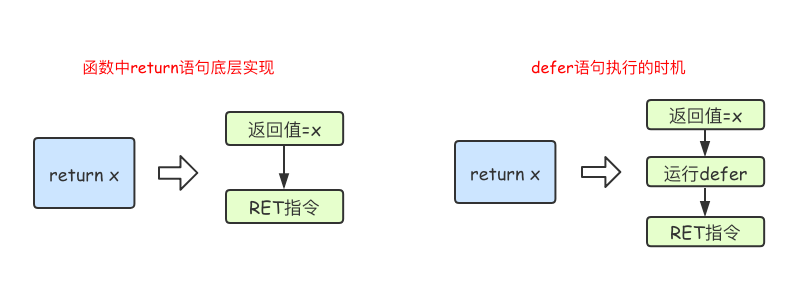

# 1.5.5、流程控制结构之defer语句
Go语言中的`defer`语句会将其后面跟随的语句进行延迟处理。
在`defer`归属的函数即将返回时，将延迟处理的语句按`defer`定义的逆序进行执行，也就是说，先被`defer`的语句最后被执行，最后被`defer`的语句，最先被执行。
示例1：
```
func main() {
	fmt.Println("start")
	defer fmt.Println(1)
	defer fmt.Println(2)
	defer fmt.Println(3)
	fmt.Println("end")
}
```

输出结果：
```
start
end
3
2
1
```
由于`defer`语句延迟调用的特性，所以`defer`语句能非常方便的处理资源释放问题。比如：资源清理、文件关闭、解锁及记录时间等。

*注意：*defer注册要延迟执行的函数时该函数所有的参数都需要确定其值


##### defer执行时机
在Go语言的函数中`return`语句在底层并不是原子操作，它分为给返回值赋值和RET指令两步。
而`defer`语句执行的时机就在返回值赋值操作后，RET指令执行前。具体如下图所示：



示例一：
```
func f1() int {
	x := 5
	defer func() {
		x++
	}()
	return x
}

func f2() (x int) {
	defer func() {
		x++
	}()
	return 5
}

func f3() (y int) {
	x := 5
	defer func() {
		x++
	}()
	return x
}
func f4() (x int) {
	defer func(x int) {
		x++
	}(x)
	return 5
}
func main() {
	fmt.Println(f1())
	fmt.Println(f2())
	fmt.Println(f3())
	fmt.Println(f4())
}

```

输出结果如下：
```
5
6
5
5
```


示例2：
```
func calc(index string, a, b int) int {
	ret := a + b
	fmt.Println(index, a, b, ret)
	return ret
}

func main() {
	x := 1
	y := 2
	defer calc("AA", x, calc("A", x, y))
	x = 10
	defer calc("BB", x, calc("B", x, y))
	y = 20
}

```

输出如下：
```
A 1 2 3
B 10 2 12
BB 10 12 22
AA 1 3 4
```

 多个`defer` 是反序调用的，有点类似栈一样，后进先出。

## 即时求值的变量快照
使用 `defer` 只是延时调用函数，此时传递给函数里的变量，不应该受到后续程序的影响。

比如：
```
import "fmt"

func main() {
    name := "go"
    defer fmt.Println(name) // 输出: go

    name = "python"
    fmt.Println(name)      // 输出: python
}
```

输出如下：
```
python
go
```

可见给 name 重新赋值为 python，后续调用 defer 的时候，仍然使用未重新赋值的变量值。

