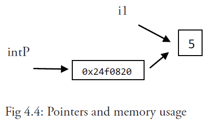
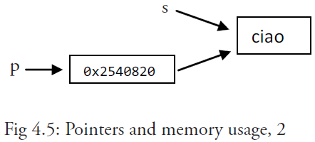

# 1.6.1、指针


### 什么是指针

任何程序数据载入内存后，在内存都有他们的地址，这就是指针。而为了保存一个数据在内存中的地址，我们就需要指针变量。
当我们定义一个变量 name
```
var name string = "Go指针"
```
此时，`name` 是变量名，它只是编程语言中方便程序员编写和理解代码的一个标签。

当我们访问这个标签时，机算机会返回给我们它指向的内存地址里存储的值：Go指针。

出于某些需要，我们会将这个内存地址赋值给另一个变量名，通常叫做 `ptr（pointer的简写）`，而这个变量，我们称之为指针变量。

`ptr`:用于接收地址的变量，`ptr`的类型就为`*T`，称做`T`的指针类型。`*`代表指针。

换句话说，指针变量（一个标签）的值是指针，也就是内存地址。默认值为 nil ，使用 `&` 取变量地址，放到一个变量前使用就会返回相应变量的内存地址。通过 `*` 访问目标对象。

一个指针变量可以指向任何一个值的内存地址 它指向那个值的内存地址，在 32 位机器上占用 4 个字节，在 64 位机器上占用 8 个字节，并且与它所指向的值的大小无关。当然，可以声明指针指向任何类型的值来表明它的原始性或结构性；你可以在指针类型前面加上 `*` 号（前缀）来获取指针所指向的内容，这里的 `*` 号是一个类型更改器。使用一个指针引用一个值被称为间接引用。


注意事项：

在书写表达式类似 `var p *type` 时，切记在 `*` 号和指针名称间留有一个空格，因为 `- var p*type` 是语法正确的，但是在更复杂的表达式中，它容易被误认为是一个乘法表达式！

符号 `*` 可以放在一个指针前，如 `*intP`，那么它将得到这个指针指向地址上所存储的值；这被称为反引用（或者内容或者间接引用）操作符；另一种说法是指针转移。

对于任何一个变量 `var`， 如下表达式都是正确的：`var == *(&var)`。

根据变量指向的值，是否是内存地址，我把变量分为两种：

- 普通变量：存数据值本身
- 指针变量：存值的内存地址

不像 Java 和 .NET，Go 语言为程序员提供了控制数据结构的指针的能力；但是，不能进行指针运算。通过给予程序员基本内存布局，Go 语言允许控制特定集合的数据结构、分配的数量以及内存访问模式，这些对构建运行良好的系统是非常重要的：指针对于性能的影响是不言而喻的，而如果想要做的是系统编程、操作系统或者网络应用，指针更是不可或缺的一部分。

程序在内存中存储它的值，每个内存块（或字）有一个地址，通常用十六进制数表示，如：`0x6b0820` 或 `0xf84001d7f0`。


### 指针的创建

指针创建有三种方法

#### 第一种方法

先定义对应的变量，再通过变量取得内存地址，创建指针
```
// 定义普通变量
aint := 1
// 定义指针变量
ptr := &aint
```

举个例子：
```
func main() {
	a := 10
	b := &a
	fmt.Printf("a:%d ptr:%p\n", a, &a) // a:10 ptr:0xc00001a078
	fmt.Printf("b:%p type:%T\n", b, b) // b:0xc00001a078 type:*int
	fmt.Println(&b)                    // 0xc00000e018
}
```

输出如下：
```
a:10 ptr:0xc00001a078
b:0xc00001a078 type:*int
0xc00000e018
```

来看一下`b := &a`的图示：


 
#### 第二种方法
使用new()函数
`new()`函数可以在 `heap`堆 区申请一片内存地址空间：
```
    var p *bool
    p = new(bool)
    fmt.Println(*p)
```

先创建指针，分配好内存后，再给指针指向的内存地址写入对应的值。
```
// 创建指针
astr := new(string)
// 给指针赋值
*astr = "Go指针"
```

#### 第三种方法

先声明一个指针变量，再从其他变量取得内存地址赋值给它
```
var bint *int  // 声明一个指针
aint := 1
bint = &aint   // 初始化
```
上面的三段代码中，指针的操作都离不开这两个符号：
- `&` ：从一个普通变量中取得内存地址
- `*`：当*在赋值操作值的右边，是从一个指针变量中取得变量值，当*在赋值操作值的左边，是指该指针指向的变量

通过下面这段代码，就可以熟悉这两个符号的用法
示例一：
```
package main

import "fmt"

func main() {
    aint := 1     // 定义普通变量
    ptr := &aint  // 定义指针变量
    fmt.Println("普通变量存储的是：", aint)
    fmt.Println("普通变量存储的是：", *ptr)
    fmt.Println("指针变量存储的是：", &aint)
    fmt.Println("指针变量存储的是：", ptr)
}
```
输出如下
```
普通变量存储的是： 1
普通变量存储的是： 1
指针变量存储的是： 0xc0000100a0
指针变量存储的是： 0xc0000100a0
```
要想打印指针指向的内存地址，方法有两种

// 第一种
```
fmt.Printf("%p", ptr)
```

// 第二种
```
fmt.Println(ptr)
```

示例一：
```
package main

import (
	"fmt"
)

func main() {
	var i1 = 5
	fmt.Printf("整数： %d的内存地址为: %p\n", i1, &i1)
	var intP *int
	intP = &i1
	fmt.Printf("内存地址为 %p 的是 %d\n", intP, *intP)
}

```
输出如下：
```
整数： 5 的内存地址为: 0xc00000a0b8
内存地址为 0xc00000a0b8 的是 5
```

可以用下图来表示内存使用的情况：



示例二：
它展示了分配一个新的值给 *p 并且更改这个变量自己的值（这里是一个字符串）。
```
package main

import (
	"fmt"
)

func main() {
	s := "good bye"
	var p *string = &s
	*p = "ciao"
	fmt.Printf("这是指针p: %p\n", p) // prints address
	fmt.Printf("这是字符串 *p: %s\n", *p) // prints string
	fmt.Printf("这是字符串 s: %s\n", s) // prints same string
}
}
```
输出三：
```
这是指针p: 0xc0000441f0
这是字符串 *p: ciao
这是字符串 s: ciao
```
通过对 `*p` 赋另一个值来更改“对象”，这样 s 也会随之更改。

内存示意图如下：


注意事项

你不能获取字面量或常量的地址，例如：
```
const i = 5
ptr := &i //error: cannot take the address of i
ptr2 := &10 //error: cannot take the address of 10
```
所以说，`Go` 语言和 `C`、`C++` 语言一样，都有指针的概念。但是对于经常导致 `C` 语言内存泄漏继而程序崩溃的指针运算（所谓的指针算法，如：`pointer+2`，移动指针指向字符串的字节数或数组的某个位置）是不被允许的。`Go` 语言中的指针保证了内存安全，更像是 `Java`、`C#` 和 `VB``.NET` 中的引用。

因此 `c = *p++` 在 `Go` 语言的代码中是不合法的。

指针的一个高级应用是可以传递一个变量的引用（如函数的参数），这样不会传递变量的拷贝。指针传递是很廉价的，只占用 4 个或 8 个字节。当程序在工作中需要占用大量的内存，或很多变量，或者两者都有，使用指针会减少内存占用和提高效率。被指向的变量也保存在内存中，直到没有任何指针指向它们，所以从它们被创建开始就具有相互独立的生命周期。

另一方面，由于一个指针导致的间接引用（一个进程执行了另一个地址），指针的过度频繁使用也会导致性能下降。

指针也可以指向另一个指针，并且可以进行任意深度的嵌套，导致你可以有多级的间接引用，但在大多数情况这会使代码结构不清晰。

在大多数情况下 Go 语言可以使程序员轻松创建指针，并且隐藏间接引用，如：**自动反向引用**。

对一个空指针的反向引用是不合法的，并且会使程序崩溃：

示例一：
```
package main
func main() {
	var p *int = nil
	*p = 0
}
// in Windows: stops only with: <exit code="-1073741819" msg="process crashed"/>
// runtime error: invalid memory address or nil pointer dereference

```

**贴士：**

- **Go**语言支持多级指针，如 `**T`
- **空指针：**声明但未初始化的指针
- **野指针：**引用了无效地址的指针，如：`var p *int = 0，var p *int = 0xff00(超出范围)`
- **Go**语言中直接使用.访问目标成员
- Go不支持指针运算

区别于C/C++中的指针，由于垃圾回收机制的存在，指针运算造成许多困扰，所以Go直接禁止了指针运算，Go语言中的指针不能进行偏移和运算，是安全指针。
```
	a := 1
	p := &a
	p++        //报错：non-numeric type *int
```


所以若我们定义一个只接收指针类型的参数的函数，可以这么写
```
func mytest(ptr *int)  {
    fmt.Println(*ptr)
}
```

### 指针的类型

我们知道字符串的类型是 string，整型是int，那么指针如何表示呢？

写段代码试验一下就知道了


示例一：
```
package main

import "fmt"

func main() {
    astr := "hello"
    aint := 1
    abool := false
    arune := 'a'
    afloat := 1.2

    fmt.Printf("astr 指针类型是：%T\n", &astr)
    fmt.Printf("aint 指针类型是：%T\n", &aint)
    fmt.Printf("abool 指针类型是：%T\n", &abool)
    fmt.Printf("arune 指针类型是：%T\n", &arune)
    fmt.Printf("afloat 指针类型是：%T\n", &afloat)
}
```
输出如下，可以发现用 `*+`所指向变量值的数据类型，就是对应的指针类型。
```
astr 指针类型是：*string
aint 指针类型是：*int
abool 指针类型是：*bool
arune 指针类型是：*int32
afloat 指针类型是：*float64
```

### 指针的零值

当指针声明后，没有进行初始化，其零值是 `nil`。
```
func main() {
    a := 25
    var b *int  // 声明一个指针

    if b == nil {
        fmt.Println(b)
        b = &a  // 初始化：将a的内存地址给b
        fmt.Println(b)
    }
}
```
输出如下
```
<nil>
0xc0000100a0
```

指针使用示例：实现变量值交换
```
	func swap(p1,p2 *int) {
	*p1,*p2 = *p2,*p1
	}
```

### 结构体指针

示例：
```
	type User struct{
		name string
		age int
	}

	func main() {
		var u = User{
			name:"lisi",
			age: 18,
		}
		p := &u
		fmt.Println(u.name)		//输出李四
		fmt.Println(p.name)		//输出李四
	}
```