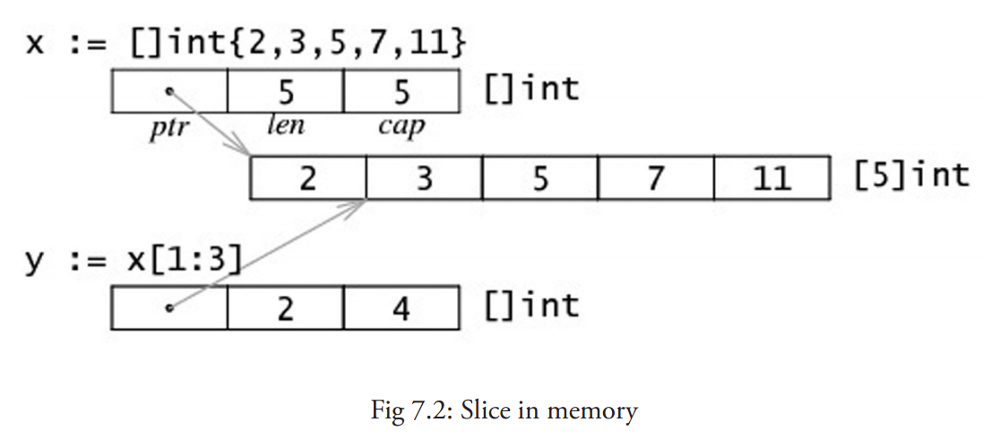
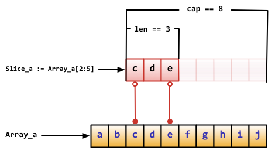
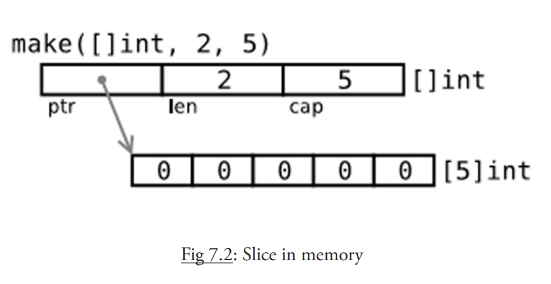
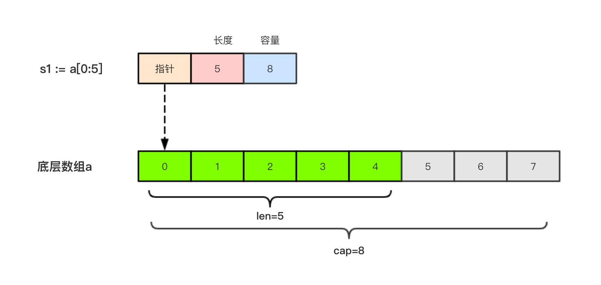
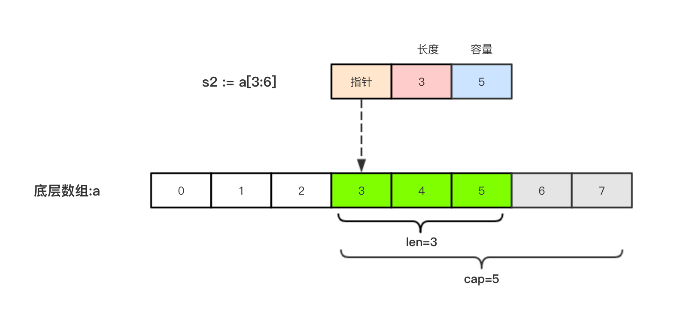
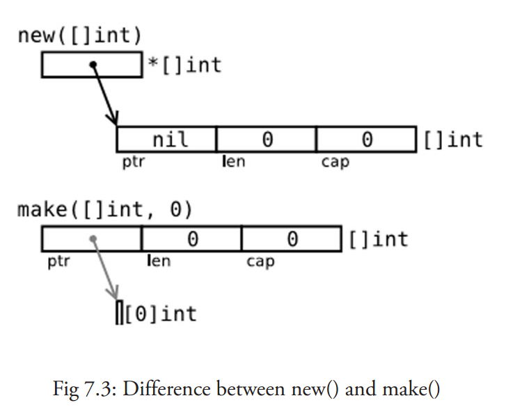

# 1.6.2、切片

## 切片的定义
切片（Slice）是一个拥有相同类型元素的可变长度的序列，一般用于快速地操作一块数据集合。它是基于数组类型做的一层封装。它非常灵活，支持自动扩容。与数组一样，也是可以容纳若干类型相同的元素的容器。与数组不同的是，无法通过切片类型来确定其值的长度。每个切片值都会将数组作为其底层数据结构。我们也把这样的数组称为切片的底层数组。

声明切片类型的基本语法如下：
```
var name []T （不需要说明长度）
```

其中：
- `name`:表示变量名
- `T`:表示切片中的元素类型
- 一个切片在未初始化之前默认为 `nil`，长度为 0。

```
import (
    "fmt"
)

func main() {
    myarr := [...]int{1, 2, 3}
    fmt.Printf("%d 的类型是: %T", myarr[0:2], myarr[0:2])
}


```
输出 如下
```
[1 2] 的类型是: []int
```

切片是一个引用类型，它的底层就是一个长度可变的数组，是对数组的一个连续片段的引用（该数组我们称之为相关数组，通常是匿名的，所以我们可以基于数组通过切片表达式得到切片。），所以切片是一个引用类型（因此更类似于 `C/C++` 中的数组类型，或者 `Python` 中的 `list` 类型）。它的内部结构包含地址、长度和容量。这个片段可以是整个数组，也可以是由起始和终止索引标识的一些项的子集。需要注意的是，终止索引标识的项不包括在切片内（意思是这是个左闭右开的区间）。给定项的切片索引可能比相关数组的相同元素的索引小。和数组不同的是，切片的长度可以在运行时修改，由 `len()` 函数获取长度，最小为 0， 最大为相关数组的长度。可以说切片提供了一个相关数组的动态窗口。

切片提供了计算容量的函数 `cap()` 可以测量切片最长可以达到多少：它等于切片的长度 `+` 数组除切片之外的长度。如果 `s` 是一个切片，`cap(s)` 就是从 `s[0]` 到数组末尾的数组长度。切片的长度永远不会超过它的容量，所以对于 切片 `s` 来说，该不等式永远成立：`0 <= len(s) <= cap(s)`。

多个切片如果表示同一个数组的片段，它们可以共享数据；因此一个切片和相关数组的其他切片是共享存储的，相反，不同的数组总是代表不同的存储。数组实际上是切片的构建块。

**优点：
因为切片是引用，所以它们不需要使用额外的内存并且比使用数组更有效率，所以在 Go 代码中 切片比数组更常用。**

数组 与 切片 有相同点，它们都是可以容纳若干类型相同的元素的容器
也有不同点，数组的容器大小固定，而切片本身是引用类型。


切片的初始化格式是：`var slice1 []type = arr1[start:end]`。

这表示 `slice1` 是由数组 `arr1` 从 `start` 索引到 `end-1` 索引之间的元素构成的子集（切分数组，`start:end` 被称为 `slice` 表达式）。所以 `slice1[0] `就等于 `arr1[start]`。这可以在 `arr1` 被填充前就定义好。

如果某个人写：`var slice1 []type = arr1[:]` 那么` slice1 `就等于完整的 `arr1` 数组（所以这种表示方式是 `arr1[0:len(arr1)]` 的一种缩写）。

另外一种表述方式是：`slice1 = &arr1`。

**注意 绝对不要用指针指向 slice。切片本身已经是一个引用类型，所以它本身就是一个指针!!**

`arr1[2:]` 和 `arr1[2:len(arr1)]` 相同，都包含了数组从第三个到最后的所有元素。

`arr1[:3]` 和 `arr1[0:3]` 相同，包含了从第一个到第三个元素（不包括第四个）。

如果你想去掉`slice1`的最后一个元素，只要 `slice1 = slice1[:len(slice1)-1]`。

一个由数字 1、2、3 组成的切片可以这么生成：`s := [3]int{1,2,3}[:]`(注: 应先用`s := [3]int{1, 2, 3}`生成数组, 再使用`s[:]`转成切片) 甚至更简单的 `s := []int{1,2,3}`。

`s2 := s[:]` 是用切片组成的切片，拥有相同的元素，但是仍然指向相同的相关数组。

一个切片 s 可以这样扩展到它的大小上限：`s = s[:cap(s)]`，如果再扩大的话就会导致运行时错误。

对于每一个切片（包括 `string`），以下状态总是成立的：

```
s == s[:i] + s[i:] // i是一个整数且: 0 <= i <= len(s)
len(s) <= cap(s)
```

**注意：
对于数组或字符串，如果0 <= low <= high <= len(a)，则索引合法，否则就会索引越界（out of range）。**

切片也可以用类似数组的方式初始化：`var x = []int{2, 3, 5, 7, 11}`。这样就创建了一个长度为 5 的数组并且创建了一个相关切片。

切片在内存中的组织方式实际上是一个有 3 个域的结构体：指向相关数组的指针，切片长度以及切片容量。下图给出了一个长度为 2，容量为 4 的切片y。

```
y[0] = 3 且 y[1] = 5。
切片 y[0:4] 由 元素 3，5，7 和 11 组成。
```



示例如下：

```
// 声明一个含有10个元素元素类型为byte的数组
var ar = [10]byte {'a', 'b', 'c', 'd', 'e', 'f', 'g', 'h', 'i', 'j'}

// 声明两个含有byte的slice
var a, b []byte

// a指向数组的第3个元素开始，并到第五个元素结束，
a = ar[2:5]
//现在a含有的元素: ar[2]、ar[3]和ar[4]

// b是数组ar的另一个slice
b = ar[3:5]
// b的元素是：ar[3]和ar[4]

//声明一个字符串切片
var a []string

//声明一个整型切片并初始化
var b = []int{}

//声明一个布尔切片并初始化
var c = []bool{false, true}

//声明一个布尔切片并初始化
var d = []bool{false, true}
```
**注意：** 
> slice和数组在声明时的区别：声明数组时，方括号内写明了数组的长度或使用`...`自动计算长度，而声明`slice`时，方括号内没有任何字符。

它们的数据结构如下所示:


slice有一些简便的操作

- `slice`的默认开始位置是0，`ar[:n`]等价于`ar[0:n]`
- `slice`的第二个序列默认是数组的长度，`ar[n:]`等价于`ar[n:len(ar)]`
- 如果从一个数组里面直接获取`slice`，可以这样`ar[:]`，因为默认第一个序列是0，第二个是数组的长度，即等价于`ar[0:len(ar)]`

下面这个例子展示了更多关于`slice`的操作：
```
// 声明一个数组
var array = [10]byte{'a', 'b', 'c', 'd', 'e', 'f', 'g', 'h', 'i', 'j'}
// 声明两个slice
var aSlice, bSlice []byte

// 演示一些简便操作
aSlice = array[:3] // 等价于aSlice = array[0:3] aSlice包含元素: a,b,c
aSlice = array[5:] // 等价于aSlice = array[5:10] aSlice包含元素: f,g,h,i,j
aSlice = array[:]  // 等价于aSlice = array[0:10] 这样aSlice包含了全部的元素

// 从slice中获取slice
aSlice = array[3:7]  // aSlice包含元素: d,e,f,g，len=4，cap=7
bSlice = aSlice[1:3] // bSlice 包含aSlice[1], aSlice[2] 也就是含有: e,f
bSlice = aSlice[:3]  // bSlice 包含 aSlice[0], aSlice[1], aSlice[2] 也就是含有: d,e,f
bSlice = aSlice[0:5] // 对slice的slice可以在cap范围内扩展，此时bSlice包含：d,e,f,g,h
bSlice = aSlice[:]   // bSlice包含所有aSlice的元素: d,e,f,g
```
`slice`是引用类型，所以当引用改变其中元素的值时，其它的所有引用都会改变该值，例如上面的`aSlice`和`bSlice`，如果修改了`aSlice`中元素的值，那么`bSlice`相对应的值也会改变。

从概念上面来说`slice`像一个结构体，这个结构体包含了三个元素：
- 一个指针，指向数组中slice指定的开始位置
- 长度，即slice的长度
- 最大长度，也就是slice开始位置到数组的最后位置的长度
```
Array_a := [10]byte{'a', 'b', 'c', 'd', 'e', 'f', 'g', 'h', 'i', 'j'}
Slice_a := Array_a[2:5]
```
上面代码的真正存储结构如下图所示：



对切片再切片时，`end`的上限边界是切片的容量`cap(a)`，而不是长度。常量索引必须是非负的，并且可以用`int`类型的值表示;

对于数组或常量字符串，常量索引也必须在有效范围内。如果`start`和`end`两个指标都是常数，它们必须满足`start` <= `end`。如果索引在运行时超出范围，就会发生运行时`panic`。

```
func main() {
	a := [5]int{1, 2, 3, 4, 5}
	s := a[1:3]  // s := a[start:end]
	fmt.Printf("s:%v len(s):%v cap(s):%v\n", s, len(s), cap(s))
	s2 := s[3:4]  // 索引的上限是cap(s)而不是len(s)
	fmt.Printf("s2:%v len(s2):%v cap(s2):%v\n", s2, len(s2), cap(s2))
}
```

输出如下：
```
s:[2 3] len(s):2 cap(s):4
s2:[5] len(s2):1 cap(s2):1
```


## 切片的构造

切片的构造，有四种方式

### 1、对数组进行片段截取

（上面例子已经展示：`myarr[0:2]`，0是索引起始值，2是索引终止值，区间左闭右开），当你使用这种方式生成切片对象时，切片的容量会从截取的起始索引到原数组的终止索引


```
// 定义一个数组
myarr := [5]int{1,2,3,4,5}

// 【第一种】切片的简单表达式
// 1 表示从索引1开始，直到到索引为 2 (3-1)的元素
mysli1 := myarr[1:3]

// 【第二种】切片的完整表达式
// 1 表示从索引1开始，直到到索引为 2 (3-1)的元素
mysli2 := myarr[1:3:4]
```

上面的 `mysli1` 和 `mysli2` 打印出来的结果是一样的.

对于第二种的截取方式格式如下：

```
a[start : end : max]
```

上面的代码会构造与简单切片表达式`a[start: end]`相同类型、相同长度和元素的切片。另外，它会将得到的结果切片的容量设置为`max-start`。在完整切片表达式中只有第一个索引值（`start`）可以省略；它默认为0。

```
func main() {
	a := [5]int{1, 2, 3, 4, 5}
	t := a[1:3:5]
	fmt.Printf("t:%v len(t):%v cap(t):%v\n", t, len(t), cap(t))
}
```

输出结果：

```
t:[2 3] len(t):2 cap(t):4
```
完整切片表达式需要满足的条件是`0 <= start <= end <= max <= cap(a)`，其他条件和简单切片表达式相同。


在切片时，若不指定第三个数，那么切片终止索引会一直到原数组的最后一个数。而如果指定了第三个数，那么切片终止索引只会到原数组的该索引值。

用下面这段代码来验证一下
```
package main
import "fmt"

func main(){
    myarr := [5]int{1,2,3,4,5}
    fmt.Printf("myarr 的长度为：%d，容量为：%d\n", len(myarr), cap(myarr))

    mysli1 := myarr[1:3]
    fmt.Printf("mysli1 的长度为：%d，容量为：%d\n", len(mysli1), cap(mysli1))
    fmt.Println(mysli1)

    mysli2 := myarr[1:3:4]
    fmt.Printf("mysli2 的长度为：%d，容量为：%d\n", len(mysli2), cap(mysli2))
    fmt.Println(mysli2)
}
```

输出如下，说明切片的第三个数，影响的只是切片的容量，而不会影响长度

```
myarr 的长度为：5，容量为：5
mysli1 的长度为：2，容量为：4
[2 3]
mysli2 的长度为：2，容量为：3
[2 3]
```


### 2、从头声明赋值
（例子如下）
```
// 声明字符串切片
var strList []string

// 声明整型切片
var numList []int

// 声明一个空切片
var numListEmpty = []int{}
```


### 3、使用 `make` 函数构造

`make` 函数的格式：`make( []Type, size, cap )`
这个函数刚好指出了，一个切片具备的三个要素：`类型（Type），长度（size），容量（cap）`


下图描述了使用 make 方法生成的切片的内存结构：




示例一、：

```
import (
    "fmt"
)
func main() {
    a := make([]int, 2)
    b := make([]int, 2, 10)
    fmt.Println(a, b)
    fmt.Println(len(a), len(b))
    fmt.Println(cap(a), cap(b))
}
```


输出 如下：

```
[0 0] [0 0]
2 2
2 10
```

上面代码中b的内部存储空间已经分配了10个，但实际上只用了2个。 容量并不会影响当前元素的个数，所以`len(b)`返回2，`cap(b)`则返回该切片的容量。


示例二：
```
package main
import "fmt"

func main() {
	var slice1 []int = make([]int, 10)
	// load the array/slice:
	for i := 0; i < len(slice1); i++ {
		slice1[i] = 5 * i
	}

	// print the slice:
	for i := 0; i < len(slice1); i++ {
		fmt.Printf("Slice at %d is %d\n", i, slice1[i])
	}
	fmt.Printf("\nThe length of slice1 is %d\n", len(slice1))
	fmt.Printf("The capacity of slice1 is %d\n", cap(slice1))
}
```

输出如下：
```
Slice at 0 is 0
Slice at 1 is 5
Slice at 2 is 10
Slice at 3 is 15
Slice at 4 is 20
Slice at 5 is 25
Slice at 6 is 30
Slice at 7 is 35
Slice at 8 is 40
Slice at 9 is 45

The length of slice1 is 10
The capacity of slice1 is 10
```
因为字符串是纯粹不可变的字节数组，它们也可以被切分成 切片。


### 总结：
使用`make`函数创建：
```
slice1 := make([]int,5)		// 创建长度为5，容量为5，初始值为0的切片
slice2 := make([]int,5,7)	// 创建长度为5，容量为7，初始值为0的切片
slice3 := []int{1,2,3,4,5}	// 创建长度为5，容量为5，并已经初始化的切片
```

### 4、使用和数组一样偷懒的方法
```
import (
    "fmt"
)
func main() {
    a := []int{4:2}
    fmt.Println(a)
    fmt.Println(len(a), cap(a))
}
```
输出如下
```
[0 0 0 0 2]
5 5
```

关于 len 和 cap 的概念，可能不好理解 ，这里举个例子：
- 公司名，相当于字面量，也就是变量名。
- 公司里的所有工位，相当于已分配到的内存空间
- 公司里的员工，相当于元素
- `cap` 代表你这个公司最多可以容纳多少员工
- `len` 代表你这个公司当前有多少个员工
- 由于 切片是引用类型，所以你不对它进行赋值的话，它的零值（默认值）是 `nil`


```
var myarr []int
fmt.Println(myarr == nil)
// true
```


切片的本质就是对底层数组的封装，它包含了三个信息：底层数组的指针、切片的长度`（len）`和切片的容量`（cap）`。

举个例子，现在有一个数组
```
a := [8]int{0, 1, 2, 3, 4, 5, 6, 7}
切片s1 := a[:5]
```

相应示意图如下。



切片`s2 := a[3:6]`，相应示意图如下：




## 切片不能直接比较

切片之间是不能比较的，我们不能使用`==`操作符来判断两个切片是否含有全部相等元素。 切片唯一合法的比较操作是和`nil`比较。 一个`nil`值的切片并没有底层数组，一个`nil`值的切片的长度和容量都是0。但是我们不能说一个长度和容量都是0的切片一定是`nil`，例如下面的示例：

```
var s1 []int         //len(s1)=0;cap(s1)=0;s1==nil
s2 := []int{}        //len(s2)=0;cap(s2)=0;s2!=nil
s3 := make([]int, 0) //len(s3)=0;cap(s3)=0;s3!=nil
```

所以要判断一个切片是否是空的，应该使用`len(s) == 0`来判断，而不应该使用`s == nil`来判断。。


##  切片的赋值拷贝

下面的代码中演示了拷贝前后两个变量共享底层数组，对一个切片的修改会影响另一个切片的内容，这点需要特别注意。
```
func main() {
	s1 := make([]int, 3) //[0 0 0]
	s2 := s1             //将s1直接赋值给s2，s1和s2共用一个底层数组
	s2[0] = 100
	fmt.Println(s1) //[100 0 0]
	fmt.Println(s2) //[100 0 0]
}
```
## 切片遍历

切片的遍历方式和数组是一致的，支持索引遍历和`for range`遍历。

```
func main() {
	s := []int{1, 3, 5}

	for i := 0; i < len(s); i++ {
		fmt.Println(i, s[i])
	}

	for index, value := range s {
		fmt.Println(index, value)
	}
}
```


## append()方法为切片添加元素

```
import (
    "fmt"
)
func main() {
    myarr := []int{1}
    // 追加一个元素
    myarr = append(myarr, 2)
    // 追加多个元素
    myarr = append(myarr, 3, 4)
    // 追加一个切片, ... 表示解包，不能省略
    myarr = append(myarr, []int{7, 8}...)
    // 在第一个位置插入元素
    myarr = append([]int{0}, myarr...)
    // 在中间插入一个切片(两个元素)
    myarr = append(myarr[:5], append([]int{5,6}, myarr[5:]...)...)
    fmt.Println(myarr)
}
```


输出 如下

```
[0 1 2 3 4 5 6 7 8]
```

Go语言的内建函数`append()`可以为切片动态添加元素。 可以一次添加一个元素，可以添加多个元素，也可以添加另一个切片中的元素（后面加`…`）。
```
func main(){
	var s []int
	s = append(s, 1)        // [1]
	s = append(s, 2, 3, 4)  // [1 2 3 4]
	s2 := []int{5, 6, 7}
	s = append(s, s2...)    // [1 2 3 4 5 6 7]
}
```
注意：通过var声明的零值切片可以在append()函数直接使用，无需初始化。
```
var s []int
s = append(s, 1, 2, 3)
```
没有必要像下面的代码一样初始化一个切片再传入append()函数使用，
```
s := []int{}  // 没有必要初始化
s = append(s, 1, 2, 3)

var s = make([]int)  // 没有必要初始化
s = append(s, 1, 2, 3)
```
每个切片会指向一个底层数组，这个数组的容量够用就添加新增元素。当底层数组不能容纳新增的元素时，切片就会自动按照一定的策略进行“扩容”，此时该切片指向的底层数组就会更换。“扩容”操作往往发生在`append()`函数调用时，所以我们通常都需要用原变量接收append函数的返回值。

举个例子：
```
func main() {
	//append()添加元素和切片扩容
	var numSlice []int
	for i := 0; i < 10; i++ {
		numSlice = append(numSlice, i)
		fmt.Printf("%v  len:%d  cap:%d  ptr:%p\n", numSlice, len(numSlice), cap(numSlice), numSlice)
	}
}
```
输出：
```
[0]  len:1  cap:1  ptr:0xc0000a8000
[0 1]  len:2  cap:2  ptr:0xc0000a8040
[0 1 2]  len:3  cap:4  ptr:0xc0000b2020
[0 1 2 3]  len:4  cap:4  ptr:0xc0000b2020
[0 1 2 3 4]  len:5  cap:8  ptr:0xc0000b6000
[0 1 2 3 4 5]  len:6  cap:8  ptr:0xc0000b6000
[0 1 2 3 4 5 6]  len:7  cap:8  ptr:0xc0000b6000
[0 1 2 3 4 5 6 7]  len:8  cap:8  ptr:0xc0000b6000
[0 1 2 3 4 5 6 7 8]  len:9  cap:16  ptr:0xc0000b8000
[0 1 2 3 4 5 6 7 8 9]  len:10  cap:16  ptr:0xc0000b8000
```
从上面的结果可以看出：


`append()`函数将元素追加到切片的最后并返回该切片。
切片`numSlice`的容量按照1，2，4，8，16这样的规则自动进行扩容，每次扩容后都是扩容前的2倍。

`append()`函数还支持一次性追加多个元素。 例如：

```
var citySlice []string
// 追加一个元素
citySlice = append(citySlice, "北京")
// 追加多个元素
citySlice = append(citySlice, "上海", "广州", "深圳")
// 追加切片
a := []string{"成都", "重庆"}
citySlice = append(citySlice, a...)
fmt.Println(citySlice) //[北京 上海 广州 深圳 成都 重庆]
```

## 切片的扩容策略

可以通过查看`$GOROOT/src/runtime/slice.go`源码，其中扩容相关代码如下：
```
newcap := old.cap
doublecap := newcap + newcap
if cap > doublecap {
	newcap = cap
} else {
	if old.len < 1024 {
		newcap = doublecap
	} else {
		// Check 0 < newcap to detect overflow
		// and prevent an infinite loop.
		for 0 < newcap && newcap < cap {
			newcap += newcap / 4
		}
		// Set newcap to the requested cap when
		// the newcap calculation overflowed.
		if newcap <= 0 {
			newcap = cap
		}
	}
}
```
从上面的代码可以看出以下内容：
```
    首先判断，如果新申请容量（cap）大于2倍的旧容量（old.cap），最终容量（newcap）就是新申请的容量（cap）。
    否则判断，如果旧切片的长度小于1024，则最终容量(newcap)就是旧容量(old.cap)的两倍，即（newcap=doublecap），
    否则判断，如果旧切片长度大于等于1024，则最终容量（newcap）从旧容量（old.cap）开始循环增加原来的1/4，即（newcap=old.cap,for {newcap += newcap/4}）直到最终容量（newcap）大于等于新申请的容量(cap)，即（newcap >= cap）
    如果最终容量（cap）计算值溢出，则最终容量（cap）就是新申请容量（cap）。
```

需要注意的是，切片扩容还会根据切片中元素的类型不同而做不同的处理，比如`int`和`string`类型的处理方式就不一样。
使用`copy()`函数复制切片

首先我们来看一个问题：
```
func main() {
	a := []int{1, 2, 3, 4, 5}
	b := a
	fmt.Println(a) //[1 2 3 4 5]
	fmt.Println(b) //[1 2 3 4 5]
	b[0] = 1000
	fmt.Println(a) //[1000 2 3 4 5]
	fmt.Println(b) //[1000 2 3 4 5]
}
```
由于切片是引用类型，所以a和b其实都指向了同一块内存地址。修改 b 的同时 a 的值也会发生变化。

Go语言内建的`copy()`函数可以迅速地将一个切片的数据复制到另外一个切片空间中，`copy()`函数的使用格式如下：
```
copy(destSlice, srcSlice []T)
```
其中：

- `srcSlice: `数据来源切片
- `destSlice: `目标切片

举个例子：
```
func main() {
	// copy()复制切片
	a := []int{1, 2, 3, 4, 5}
	c := make([]int, 5, 5)
	copy(c, a)     //使用copy()函数将切片a中的元素复制到切片c
	fmt.Println(a) //[1 2 3 4 5]
	fmt.Println(c) //[1 2 3 4 5]
	c[0] = 1000
	fmt.Println(a) //[1 2 3 4 5]
	fmt.Println(c) //[1000 2 3 4 5]
}
```
## 从切片中删除元素

Go语言中并没有删除切片元素的专用方法，我们可以使用切片本身的特性来删除元素。 代码如下：
```
func main() {
	// 从切片中删除元素
	a := []int{30, 31, 32, 33, 34, 35, 36, 37}
	// 要删除索引为2的元素
	a = append(a[:2], a[3:]...)
	fmt.Println(a) //[30 31 33 34 35 36 37]
}
```
总结一下就是：要从切片 a 中删除索引为 index 的元素，操作方法是`a = append(a[:index], a[index+1:]...)`


## 将切片传递给函数

如果有一个函数需要对数组做操作，可能总是需要把参数声明为切片。当调用该函数时，把数组分片，创建为一个 切片引用并传递给该函数。这里有一个计算数组元素和的方法:
```
func sum(a []int) int {
	s := 0
	for i := 0; i < len(a); i++ {
		s += a[i]
	}
	return s
}

func main() {
	var arr = [5]int{0, 1, 2, 3, 4}
	sum(arr[:])
}
```


```
func test(s []int) {
	fmt.Printf("test---%p\n", s) // 打印与main函数相同的地址
	s = append(s, 1, 2, 3, 4, 5)
	fmt.Printf("test---%p\n", s) // 一旦append的数据超过切片长度，则会打印新地址
	fmt.Println("test---", s)    // [0 0 0 1 2 3 4 5]
}

func main() {

	s1 := make([]int, 3)
	test(s1)
	fmt.Printf("main---%p\n", s1) // 不会因为test函数内的append而改变
	fmt.Println("main---", s1)    // [ 0 0 0]
}
```

## 多维 切片
和数组一样，切片通常也是一维的，但是也可以由一维组合成高维。通过分片的分片（或者切片的数组），长度可以任意动态变化，所以 Go 语言的多维切片可以任意切分。而且，内层的切片必须单独分配（通过 `make` 函数）。


## bytes 包

类型 `[]byte` 的切片十分常见，Go 语言有一个 `bytes` 包专门用来解决这种类型的操作方法。

`bytes` 包和字符串包十分类似（参见第 4.7 节）。而且它还包含一个十分有用的类型 Buffer:
```
import "bytes"

type Buffer struct {
	...
}
```
这是一个长度可变的 `bytes` 的 `buffer`，提供 `Read` 和 `Write` 方法，因为读写长度未知的 `bytes` 最好使用 `buffer`。

`Buffer` 可以这样定义：`var buffer bytes.Buffer`。

或者使用 `new` 获得一个指针：`var r *bytes.Buffer = new(bytes.Buffer)`。

或者通过函数：`func NewBuffer(buf []byte) *Buffer`，创建一个 `Buffer` 对象并且用 `buf` 初始化好；`NewBuffer` 最好用在从 `buf` 读取的时候使用。

通过 `buffer` 串联字符串

在下面的代码段中，创建一个 `buffer`，通过 `buffer.WriteString(s)` 方法将字符串 `s` 追加到后面，最后再通过 `buffer.String()` 方法转换为 `string`：
```
var buffer bytes.Buffer
for {
	if s, ok := getNextString(); ok { //method getNextString() not shown here
		buffer.WriteString(s)
	} else {
		break
	}
}
fmt.Print(buffer.String(), "\n")
```
这种实现方式比使用 `+=` 要更节省内存和 `CPU`，尤其是要串联的字符串数目特别多的时候。


## 切片存储结构

与数组相比，切片多了一个存储能力值的概念，即元素个数与分配空间可以是两个不同的值，其结构如下所示：
```
type slice struct {     //结构体
	arrary = unsafe.Pointer		//指向底层数组的指针
	len int						//切片元素数量
	cap int						//底层数组的容量
}
```
所以切片通过内部的指针和相关属性引用数组片段，实现了变长方案，`Slice`并不是真正意义上的动态数组。

合理设置存储能力，可以大幅提升性能，比如知道最多元素个数为50，那么提前设置为50，而不是先设为30，可以明显减少重新分配内存的操作。

### 总结：

#### 1、切片创建与声明

从数组创建：`slice`可以从一个数组再次声明。`slice`通过`a[start: end]`来获取，其中`start`是数组的开始位置，`end`是结束位置，但不包含`a[end]`，它的长度是`end-start`:
```
// 声明一个含有10个元素元素类型为byte的数组
var arr = [10]byte {'a', 'b', 'c', 'd', 'e', 'f', 'g', 'h', 'i', 'j'}

// 声明两个含有byte的slice
var a, b []byte

// a指向数组的第3个元素开始，并到第五个元素结束，现在a含有的元素: ar[2]、ar[3]和ar[4]
a = arr[2:5]
// b是数组arr的另一个slicre,b的元素是：ar[3]和ar[4]
b = arr[3:5]
```

`slice`的默认开始位置是0，`ar[:n]`等价于`ar[0:n]`
`slice`的第二个序列默认是数组的长度，`ar[n:]`等价于`ar[n:len(ar)]`
如果从一个数组里面直接获取`slice`，可以这样`ar[:]`，因为默认第一个序列是0，第二个是数组的长度，即等价于`ar[0:len(ar)]`

#### 2、切片的截取


- `s[n]`：切片`s`中索引为位置为n的项
- `s[:]`：从切片`s`的索引位置0到`len(s)-1`所获得的切片
- `s[start:]`：从切片`s`的索引位置start到`len(s)-1`所获得的切片
- `s[:end]`：从切片`s`的索引位置0到`end`所获得的切片
- `s[start:end]`：从切片`s`的索引位置`start`到`end`所获得的切片
- `s[start:end:max]`：从`start`到`end`的切片，且容量`cap=max-start`

字符串转切片：
```
str := "hello,世界"
a := []byte(str)		//字符串转换为[]byte类型切片
b := []rune(str)		//字符串转换为[]rune类型切片
```

#### 3、函数、
对于slice有几个有用的内置函数：
- `len()` 获取`slice`的长度
- `cap()` 获取`slice`的最大容量
- `append()` 向`slice`里面追加一个或者多个元素，然后返回一个和`slice`一样类型的`slice`
- `copy(dst, src []Type)` 函数`copy`从源`slice`的`src`中复制元素到目标`dst`，并且返回复制的元素的个数

注：`append`函数会改变`slice`所引用的数组的内容，从而影响到引用同一数组的其它`slice`。 但当`slice`中没有剩余空间，即`(cap-len) == 0`时，此时将动态分配新的数组空间。返回的`slice`数组指针将指向这个空间，而原数组的内容将保持不变；其它引用此数组的`slice`则不受影响。
```
var array [10]int
slice := array[2:4]
```
这个例子里面slice的容量是8，新版本里面可以指定这个容量
```
slice = array[2:4:7]
```
上面这个的容量就是7-2，即5。这样这个产生的新的`slice`就没办法访问最后的三个元素。

如果slice是这样的形式`a[:end:max]`，即第一个参数为空，默认值就是0。


切片常见操作：
```
//切片增加
slice1 = append(slice1,1,2)
fmt.Println(slice1)						//输出[0 0 0 0 0 1 2]

//切片增加一个新切片
sliceTemp := make([]int,3)
slice1 = append(slice1,sliceTemp...)
fmt.Println(slice1)						//输出[0 0 0 0 0 1 2 0 0 0]

//切片拷贝
s1 := []int{1,3,6,9}
s2 := make([]int, 10)	//必须给与充足的空间
num := copy(s2, s1)

fmt.Println(s1)			//[1 3 6 9]
fmt.Println(s2)			//[1 3 6 9 0 0 0 0 0 0]
fmt.Println(num)		//4

//切片中删除元素
s1 := []int{1,3,6,9}
index := 2					//删除该位置元素
s1 = append(s1[:index], s1[index+1:]...)
fmt.Println(s1)				//[1 3 9]

// 切片拷贝
s1 := []int{1,2,3,4,5}
s2 := []int{6,7,8}
copy(s1,s2) 				//复制s2前三个元素到slice1前3位置
copy(s2,s1)	 				//复制s1前三个元素到slice2
```
注意：没有`...`会编译错误，默认第二个参数后是元素值，传入切片需要展开。如果追加的长度超过当前已分配的存储空间，切片会自动分配更大的内存


思考:
```
package main

import (
    "fmt"
)

func main() {
    var numbers4 = [...]int{1, 2, 3, 4, 5, 6, 7, 8, 9, 10}
    myslice := numbers4[4:6:8]
    fmt.Printf("myslice为 %d, 其长度为: %d\n", myslice, len(myslice))
    myslice = myslice[:cap(myslice)]
    fmt.Printf("myslice的第四个元素为: %d", myslice[3])
}
```
为什么 `myslice` 的长度为2，却能访问到第四个元素
`myslice`为 `[5 6]`, 其长度为: `2`
`myslice`的第四个元素为: `8`


### 指针与切片

切片与指针一样，都是引用类型。

如果我们想通过一个函数改变一个数组的值，有两种方法

1、将这个数组的切片做为参数传给函数

2、将这个数组的指针做为参数传给函数

尽管二者都可以实现目的，但是按照 Go 语言的使用习惯，建议使用第一种方法，因为第一种方法，写出来的代码会更加简洁，易读。

**1、使用切片**
```
func modify(sls []int) {
    sls[0] = 90
}

func main() {
    a := [3]int{89, 90, 91}
    modify(a[:])
    fmt.Println(a)
}
```
**2、使用指针**
```
func modify(arr *[3]int) {
    (*arr)[0] = 90
}

func main() {
    a := [3]int{89, 90, 91}
    modify(&a)
    fmt.Println(a)
}
```


## new() 和 make() 的区别
看起来二者没有什么区别，都在堆上分配内存，但是它们的行为不同，适用于不同的类型。

- new(T) 为每个新的类型T分配一片内存，初始化为 0 并且返回类型为*T的内存地址：这种方法 返回一个指向类型为 T，值为 0 的地址的指针，它适用于值类型如数组和结构体（参见第 10 章）；它相当于 &T{}。
- make(T) 返回一个类型为 T 的初始值，它只适用于3种内建的引用类型：切片、map 和 channel（参见第 8 章，第 13 章）。

换言之，new 函数分配内存，make 函数初始化；下图给出了区别：



在上图的第一幅图中：
```
var p *[]int = new([]int) // *p == nil; with len and cap 0
p := new([]int)
```
在第二幅图中， `p := make([]int, 0)` ，切片 已经被初始化，但是指向一个空的数组。

以上两种方式实用性都不高。下面的方法：
```
var v []int = make([]int, 10, 50)
```
或者
```
v := make([]int, 10, 50)
```
这样分配一个有 50 个 `int` 值的数组，并且创建了一个长度为 10，容量为 50 的 切片 v，该 切片 指向数组的前 10 个元素。


## 如何理解new、make、slice、map、channel的关系

1. `slice`、`map`以及`channel`都是`golang`内建的一种引用类型，三者在内存中存在多个组成部分， 需要对内存组成部分初始化后才能使用，而`make`就是对三者进行初始化的一种操作方式

2. `new` 获取的是存储指定变量内存地址的一个变量，对于变量内部结构并不会执行相应的初始化操作， 所以`slice`、`map`、`channel`需要`make`进行初始化并获取对应的内存地址，而非`new`简单的获取内存地址