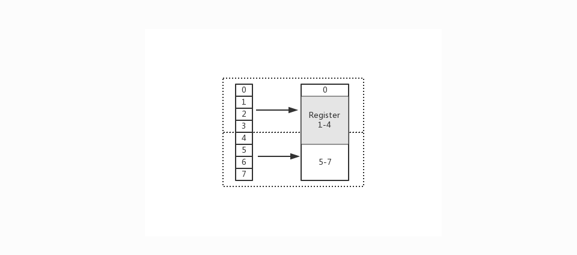
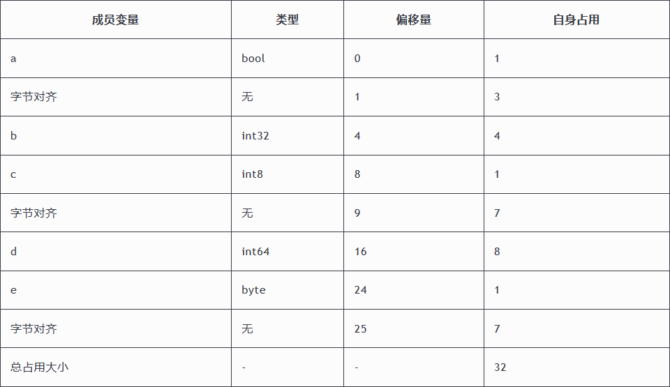
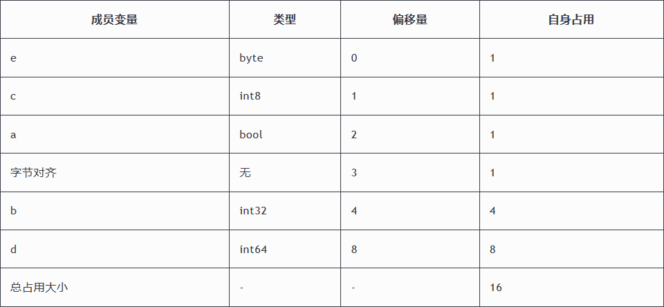
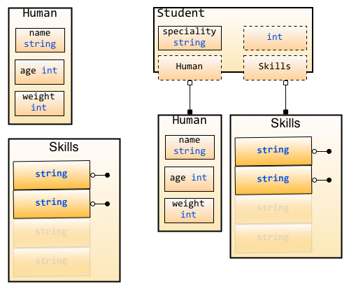

# 1.8.0、结构体
  Go语言中的基础数据类型可以表示一些事物的基本属性，但是当我们想表达一个事物的全部或部分属性时，这时候再用单一的基本数据类型明显就无法满足需求了，Go语言提供了一种自定义数据类型，可以封装多个基本数据类型，这种数据类型叫结构体，英文名称`struct`。 也就是说我们可以通过`struct`来定义自己的类型了。

  结构体(`struct`)的概念在软件工程上旧的术语叫 `ADT`（抽象数据类型：`Abstract Data Type`），在面向对象的编程语言中，跟一个无方法的轻量级类一样。不过因为 Go 语言中没有类的概念，因此在 Go 中，结构体(`struct`)有着更为重要的地位。
  Go 通过类型别名（`alias types`）和结构体(`struct`)的形式支持用户自定义类型，或者叫定制类型。
  一个带属性的结构体试图表示一个现实世界中的实体。结构体是复合类型（`composite types`），当需要定义一个类型，它由一系列属性组成，每个属性都有自己的类型和值的时候，就应该使用结构体(`struct`)，它把数据聚集在一起。它是将多个容易类型的命令变量组合在一起的聚合数据类型。然后可以访问这些数据，就好像它是一个独立实体的一部分。结构体(`struct`)也是值类型，因此可以通过 new 函数来创建。

  组成结构体(`struct`)类型的那些数据称为 字段（`fields`）。每个字段都有一个类型和一个名字；在一个结构体(`struct`)中，字段名字必须是唯一的。

  Go语言中没有“类”的概念，也不支持“类”的继承等面向对象的概念。Go语言中通过结构体(`struct`)的内嵌再配合接口比面向对象具有更高的扩展性和灵活性。

## 自定义类型

在Go语言中有一些基本的数据类型，如`string`、整型、浮点型、布尔等数据类型， Go语言中可以使用`type`关键字来定义自定义类型。
自定义类型是定义了一个全新的类型。我们可以基于内置的基本类型定义，也可以通过struct定义

```
//将MyInt定义为int类型
type MyInt int
```

通过`type`关键字的定义，`MyInt`就是一种新的类型，它具有`int`的特性。

## 类型别名
类型别名规定：`TypeAlias`只是`Type`的别名，本质上`TypeAlias`与`Type`是同一个类型。就像一个孩子小时候有小名、乳名，上学后用学名，英语老师又会给他起英文名，但这些名字都指的是他本人。

```
type TypeAlias = Type
```
我们之前见过的`rune`和`byte`就是类型别名，他们的定义如下：

```
type byte = uint8
type rune = int32
```

#### 类型定义和类型别名的区别

类型别名与类型定义表面上看只有一个等号的差异，可以通过下面的这段代码来理解它们之间的区别。
```
//类型定义
type NewInt int

//类型别名
type MyInt = int

func main() {
	var a NewInt
	var b MyInt
	
	fmt.Printf("type of a:%T\n", a) //type of a:main.NewInt
	fmt.Printf("type of b:%T\n", b) //type of b:int
}
```

结果显示a的类型是`main.NewInt`，表示`main`包下定义的`NewInt`类型。b的类型是`int`。`MyInt`类型只会在代码中存在，编译完成时并不会有`MyInt`类型。

## 结构体定义
使用type和struct关键字来定义结构体，格式如下：
```
type 类型名 struct {
    字段名 字段类型
    字段名 字段类型
    …
}
```
其中：
- 类型名：标识自定义结构体的名称，在同一个包内不能重复。
- 字段名：表示结构体字段名。结构体中的字段名必须唯一。
- 字段类型：表示结构体字段的具体类型。
`type T struct {a, b int}` 也是合法的语法，它更适用于简单的结构体。

举个例子,定义一个Person（人）结构体，代码如下：
```
type person struct {
	name string
	city string
	age  int8
}

//同样类型的字段也可以写在一行，

type person1 struct {
	name, city string
	age        int8
}
```

这样就拥有了一个person的自定义类型，它有name、city、age三个字段，分别表示姓名、城市和年龄。使用这个person结构体就能够很方便的在程序中表示和存储人信息了。

语言内置的基础数据类型是用来描述一个值的，而结构体(`struct`)是用来描述一组值的。比如一个人有名字、年龄和居住城市等，本质上是一种聚合型的数据类型

结构体(`struct`)的字段可以是任何类型，甚至是结构体本身，也可以是函数或者接口。数组也可以看作是一种结构体类型，不过它使用下标而不是具名的字段。


## 结构体实例化

只有当结构体(`struct`)实例化时，才会真正地分配内存。也就是必须实例化后才能使用结构体的字段。

结构体(`struct`)本身也是一种类型，可以像声明内置类型一样使用var关键字声明结构体类型。

```
var 结构体实例 结构体类型
```


###### 基本实例化
举个例子：
```
type person struct {
	name string
	city string
	age  int8
}

func main() {
	var p1 person
	p1.name = "呵呵"
	p1.city = "北京"
	p1.age = 18
	fmt.Printf("p1=%v\n", p1)  //p1={呵呵 北京 18}
	fmt.Printf("p1=%#v\n", p1) //p1=main.person{name:"呵呵", city:"北京", age:18}
}
```
通过`.`来访问结构体(`struct`)的字段（成员变量）,例如p1.name和p1.age等。

###### 匿名结构体

在定义一些临时数据结构等场景下还可以使用匿名结构体

```
package main
     
import (
    "fmt"
)
     
func main() {
    var user struct{Name string; Age int}
    user.Name = "哈哈"
    user.Age = 18
    fmt.Printf("%#v\n", user)
}
```

###### 创建指针类型结构体

我们还可以通过使用`new`关键字对结构体进行实例化，得到的是结构体的地址。 它返回指向已分配内存的指针：`var t *T = new(T)`。
```
var t *T
t = new(T)
```

写这条语句的惯用方法是：`t := new(T)`，变量 t 是一个指向 T的指针，此时结构体字段的值是它们所属类型的零值。

声明 `var` t T 也会给 t 分配内存，并零值化内存，但是这个时候 t 是类型T。

在这两种方式中，t 通常被称做类型 T 的一个实例（instance）或对象（object）。

示例如下：
```
package main
import "fmt"

type struct1 struct {
    i1  int
    f1  float32
    str string
}

func main() {
    ms := new(struct1)
    ms.i1 = 10
    ms.f1 = 15.5
    ms.str= "Chris"

    fmt.Printf("The int is: %d\n", ms.i1)
    fmt.Printf("The float is: %f\n", ms.f1)
    fmt.Printf("The string is: %s\n", ms.str)
    fmt.Println(ms)
}
```


输出：
```
The int is: 10
The float is: 15.500000
The string is: Chris
&{10 15.5 Chris}
```
从打印的结果中可以看出ms是一个结构体指针。

使用 `fmt.Println` 打印一个结构体的默认输出可以很好的显示它的内容，类似使用 `%v` 选项。

就像在面向对象语言所作的那样，可以使用点号符(`.`)给字段赋值：structname.fieldname = value。

同样的，使用点号符(`.`)可以获取结构体字段的值：structname.fieldname。

在 Go 语言中这叫 选择器（`selector`）。
无论变量是一个结构体类型还是一个结构体类型指针，都使用同样的 选择器符（`selector-notation`） 来引用结构体的字段

```
var p2 = new(person)
p2.name = "小王子"
p2.age = 28
p2.city = "上海"
fmt.Printf("p2=%#v\n", p2) //p2=&main.person{name:"小王子", city:"上海", age:28}
```

###### 取结构体的地址实例化
使用`&`对结构体进行取地址操作相当于对该结构体类型进行了一次`new`实例化操作。
格式如下：
```
ins := &T{}

# T是结构体类型
# ins为结构体的实例，类型为*T，是指针类型
```

```
p3 := &person{}
fmt.Printf("%T\n", p3)     //*main.person
fmt.Printf("p3=%#v\n", p3) //p3=&main.person{name:"", city:"", age:0}
p3.name = "七米"
p3.age = 30
p3.city = "成都"
fmt.Printf("p3=%#v\n", p3) //p3=&main.person{name:"七米", city:"成都", age:30}
```

p3.name = "七米"其实在底层是(*p3).name = "七米"，这是Go语言帮我们实现的语法糖。


## 结构体初始化


没有初始化的结构体，其成员变量都是对应其类型的零值。

```
type person struct {
	name string
	city string
	age  int8
}

func main() {
	var p4 person
	fmt.Printf("p4=%#v\n", p4) //p4=main.person{name:"", city:"", age:0}
}
```


###### 使用键值对初始化
使用键值对   对结构体进行初始化时，键对应结构体的字段，值对应该字段的初始值。

```
p5 := person{
	name: "小王子",
	city: "北京",
	age:  18,
}
fmt.Printf("p5=%#v\n", p5) //p5=main.person{name:"小王子", city:"北京", age:18}


//也可以对结构体指针进行键值对初始化，例如：
p6 := &person{
	name: "小王子",
	city: "北京",
	age:  18,
}
fmt.Printf("p6=%#v\n", p6) //p6=&main.person{name:"小王子", city:"北京", age:18}
```


当某些字段没有初始值的时候，该字段可以不写。此时，没有指定初始值的字段的值就是该字段类型的零值。
```
p7 := &person{
	city: "北京",
}
fmt.Printf("p7=%#v\n", p7) //p7=&main.person{name:"", city:"北京", age:0}
```

###### 使用值的列表初始化

初始化结构体的时候可以简写，也就是初始化的时候不写键，直接写值：
```
p8 := &person{
	"沙河娜扎",
	"北京",
	28,
}
fmt.Printf("p8=%#v\n", p8) //p8=&main.person{name:"沙河娜扎", city:"北京", age:28}
```

使用这种格式初始化时，需要注意：

- 必须初始化结构体的所有字段。
- 初始值的填充顺序必须与字段在结构体中的声明顺序一致。
- 该方式不能和键值初始化方式混用。

```
package main

import "fmt"

// 声明一个新的类型
type person struct {
	name string
	age int
}

// 比较两个人的年龄，返回年龄大的那个人，并且返回年龄差
// struct也是传值的
func Older(p1, p2 person) (person, int) {
	if p1.age>p2.age {  // 比较p1和p2这两个人的年龄
		return p1, p1.age-p2.age
	}
	return p2, p2.age-p1.age
}

func main() {
	var tom person

	// 赋值初始化
	tom.name, tom.age = "Tom", 18

	// 两个字段都写清楚的初始化
	bob := person{age:25, name:"Bob"}

	// 按照struct定义顺序初始化值
	paul := person{"Paul", 43}

	tb_Older, tb_diff := Older(tom, bob)
	tp_Older, tp_diff := Older(tom, paul)
	bp_Older, bp_diff := Older(bob, paul)

	fmt.Printf("Of %s and %s, %s is older by %d years\n",
		tom.name, bob.name, tb_Older.name, tb_diff)

	fmt.Printf("Of %s and %s, %s is older by %d years\n",
		tom.name, paul.name, tp_Older.name, tp_diff)

	fmt.Printf("Of %s and %s, %s is older by %d years\n",
		bob.name, paul.name, bp_Older.name, bp_diff)
}
```

## 结构体内存布局

Go 语言中，结构体(`struct`)和它所包含的数据在内存中是以连续块的形式存在的，即使结构体(`struct`)中嵌套有其他的结构体(`struct`)，这在性能上带来了很大的优势。不像 Java 中的引用类型，一个对象和它里面包含的对象可能会在不同的内存空间中，这点和 Go 语言中的指针很像。
```
type test struct {
	a int8
	b int8
	c int8
	d int8
}
n := test{
	1, 2, 3, 4,
}
fmt.Printf("n.a %p\n", &n.a)
fmt.Printf("n.b %p\n", &n.b)
fmt.Printf("n.c %p\n", &n.c)
fmt.Printf("n.d %p\n", &n.d)
```

输出：
```
n.a 0xc0000a0060
n.b 0xc0000a0061
n.c 0xc0000a0062
n.d 0xc0000a0063
```

###### 内存对齐

有的人可能会认为内存读取，就是一个简单的字节数组摆放


上图表示一个萝卜一个坑的内存读取方式。但实际上 CPU 并不会以一个一个字节去读取和写入内存。相反 **CPU 读取内存是一块一块读取的**，块的大小可以为 2、4、6、8、16 字节等大小。**块大小称其为内存访问粒度**。如下图：


在样例中，假设访问粒度为 4。 CPU 是以每 4 个字节大小的访问粒度去读取和写入内存的。这才是正确的姿势


**为什么要关心对齐**

- 你正在编写的代码在性能（CPU、Memory）方面有一定的要求
- 你正在处理向量方面的指令
- 某些硬件平台（ARM）体系不支持未对齐的内存访问

**为什么要做对齐**

- 平台（移植性）原因：不是所有的硬件平台都能够访问任意地址上的任意数据。例如：特定的硬件平台只允许在特定地址获取特定类型的数据，否则会导致异常情况
- 性能原因：若访问未对齐的内存，将会导致 CPU 进行两次内存访问，并且要花费额外的时钟周期来处理对齐及运算。而本身就对齐的内存仅需要一次访问就可以完成读取动作




在上图中，假设从 Index 1 开始读取，将会出现很崩溃的问题。因为它的内存访问边界是不对齐的。因此 CPU 会做一些额外的处理工作。如下：

- CPU 首次读取未对齐地址的第一个内存块，读取 0-3 字节。并移除不需要的字节 0
- CPU 再次读取未对齐地址的第二个内存块，读取 4-7 字节。并移除不需要的字节 5、6、7 字节
- 合并 1-4 字节的数据
- 合并后放入寄存器

从上述流程可得出，不做 “内存对齐” 是一件有点 “麻烦” 的事。因为它会增加许多耗费时间的动作

而假设做了内存对齐，从 Index 0 开始读取 4 个字节，只需要读取一次，也不需要额外的运算。这显然高效很多，是标准的空间换时间做法


**默认系数**

在不同平台上的编译器都有自己默认的 “对齐系数”，可通过预编译命令 `#pragma pack(n)` 进行变更，n 就是代指 “对齐系数”。一般来讲，常用的平台的系数如下：
- 32 位：4
- 64 位：8

另外要注意，不同硬件平台占用的大小和对齐值都可能是不一样的。因此值不是唯一的，调试的时候需按本机的实际情况考虑

**成员对齐**
```
func main() {
	fmt.Printf("bool align: %d\n", unsafe.Alignof(bool(true)))
	fmt.Printf("int32 align: %d\n", unsafe.Alignof(int32(0)))
	fmt.Printf("int8 align: %d\n", unsafe.Alignof(int8(0)))
	fmt.Printf("int64 align: %d\n", unsafe.Alignof(int64(0)))
	fmt.Printf("byte align: %d\n", unsafe.Alignof(byte(0)))
	fmt.Printf("string align: %d\n", unsafe.Alignof("EDDYCJY"))
	fmt.Printf("map align: %d\n", unsafe.Alignof(map[string]string{}))
}
```


输出结果：
```
bool align: 1
int32 align: 4
int8 align: 1
int64 align: 8
byte align: 1
string align: 8
map align: 8
```

在 Go 中可以调用 `unsafe.Alignof` 来返回相应类型的对齐系数。通过观察输出结果，可得知基本都是 2^n，最大也不会超过 8。这是因为我电脑（64 位）编译器默认对齐系数是 8，因此最大值不会超过这个数

**整体对齐**
在上小节中，提到了结构体中的成员变量要做字节对齐。那么想当然身为最终结果的结构体，也是需要做字节对齐的

**对齐规则**
- 结构体的成员变量，第一个成员变量的偏移量为 0。往后的每个成员变量的对齐值必须为编译器默认对齐长度（`#pragma pack(n)`）或当前成员变量类型的长度（`unsafe.Sizeof`），取最小值作为当前类型的对齐值。其偏移量必须为对齐值的整数倍
- 结构体本身，对齐值必须为编译器默认对齐长度（`#pragma pack(n)`）或结构体的所有成员变量类型中的最大长度，取最大数的最小整数倍作为对齐值
- 结合以上两点，可得知若编译器默认对齐长度（`#pragma pack(n)`）超过结构体内成员变量的类型最大长度时，默认对齐长度是没有任何意义的


###### 分析流程

接下来分析一下，“它” 到底经历了些什么，影响了 “预期” 结果



**成员对齐**

- 第一个成员 a
  - 类型为 bool
  - 大小/对齐值为 1 字节
  - 初始地址，偏移量为 0。占用了第 1 位
- 第二个成员 b
  - 类型为 int32
  - 大小/对齐值为 4 字节
  - 根据规则 1，其偏移量必须为 4 的整数倍。确定偏移量为 4，因此 2-4 位为 Padding。而当前数值从第 5 位开始填充，到第 8 位。如下：axxx|bbbb

- 第三个成员 c
  - 类型为 int8
  - 大小/对齐值为 1 字节
  - 根据规则 1，其偏移量必须为 1 的整数倍。当前偏移量为 8。不需要额外对齐，填充 1 个字节到第 9 位。如下：axxx|bbbb|c…

- 第四个成员 d
  - 类型为 int64
  - 大小/对齐值为 8 字节
  - 根据规则 1，其偏移量必须为 8 的整数倍。确定偏移量为 16，因此 9-16 位为 Padding。而当前数值从第 17 位开始写入，到第 24 位。如下：axxx|bbbb|cxxx|xxxx|dddd|dddd

- 第五个成员 e
  - 类型为 byte
  - 大小/对齐值为 1 字节
  - 根据规则 1，其偏移量必须为 1 的整数倍。当前偏移量为 24。不需要额外对齐，填充 1 个字节到第 25 位。如下：axxx|bbbb|cxxx|xxxx|dddd|dddd|e…

**整体对齐**
在每个成员变量进行对齐后，根据规则 2，整个结构体本身也要进行字节对齐，因为可发现它可能并不是 2^n，不是偶数倍。显然不符合对齐的规则

根据规则 2，可得出对齐值为 8。现在的偏移量为 25，不是 8 的整倍数。因此确定偏移量为 32。对结构体进行对齐

###### 结果
Part1 内存布局：axxx|bbbb|cxxx|xxxx|dddd|dddd|exxx|xxxx

###### 小结
通过本节的分析，可得知先前的 “推算” 为什么错误？

是因为实际内存管理并非 “一个萝卜一个坑” 的思想。而是一块一块。通过空间换时间（效率）的思想来完成这块读取、写入。另外也需要兼顾不同平台的内存操作情况


#### 巧妙的结构体

在上一小节，可得知根据成员变量的类型不同，其结构体的内存会产生对齐等动作。那假设字段顺序不同，会不会有什么变化呢？
```
type Part1 struct {
	a bool
	b int32
	c int8
	d int64
	e byte
}

type Part2 struct {
	e byte
	c int8
	a bool
	b int32
	d int64
}

func main() {
	part1 := Part1{}
	part2 := Part2{}

	fmt.Printf("part1 size: %d, align: %d\n", unsafe.Sizeof(part1), unsafe.Alignof(part1))
	fmt.Printf("part2 size: %d, align: %d\n", unsafe.Sizeof(part2), unsafe.Alignof(part2))
}
```

输出结果：
```
part1 size: 32, align: 8
part2 size: 16, align: 8
```
通过结果可以惊喜的发现，只是 “简单” 对成员变量的字段顺序进行改变，就改变了结构体占用大小

接下来剖析一下 Part2，看看它的内部到底和上一位之间有什么区别，才导致了这样的结果？

**分析流程**


**成员对齐**

- 第一个成员 e
      - 类型为 byte
      - 大小/对齐值为 1 字节
      - 初始地址，偏移量为 0。占用了第 1 位
- 第二个成员 c
      - 类型为 int8
      - 大小/对齐值为 1 字节
      - 根据规则 1，其偏移量必须为 1 的整数倍。当前偏移量为 2。不需要额外对齐
- 第三个成员 a
      - 类型为 bool
      - 大小/对齐值为 1 字节
      - 根据规则 1，其偏移量必须为 1 的整数倍。当前偏移量为 3。不需要额外对齐
- 第四个成员 b
      - 类型为 int32
      - 大小/对齐值为 4 字节
      - 根据规则 1，其偏移量必须为 4 的整数倍。确定偏移量为 4，因此第 3 位为 Padding。而当前数值从第 4 位开始填充，到第 8 位。如下：ecax|bbbb
- 第五个成员 d
      - 类型为 int64
      - 大小/对齐值为 8 字节
      - 根据规则 1，其偏移量必须为 8 的整数倍。当前偏移量为 8。不需要额外对齐，从 9-16 位填充 8 个字节。如下：ecax|bbbb|dddd|dddd

**整体对齐**
符合规则 2，不需要额外对齐

**结果**

Part2 内存布局：ecax|bbbb|dddd|dddd


#### 总结

通过对比 Part1 和 Part2 的内存布局，你会发现两者有很大的不同。如下：

- Part1：axxx|bbbb|cxxx|xxxx|dddd|dddd|exxx|xxxx

- Part2：ecax|bbbb|dddd|dddd

仔细一看，Part1 存在许多 Padding。显然它占据了不少空间，那么 Padding 是怎么出现的呢？

是由于不同类型导致需要进行字节对齐，以此保证内存的访问边界

那么也不难理解，为什么调整结构体内成员变量的字段顺序就能达到缩小结构体占用大小的疑问了，是因为巧妙地减少了 Padding 的存在。让它们更 “紧凑” 了。这一点对于加深 Go 的内存布局印象和大对象的优化非常有帮助

###### 空结构体
```
var v struct{}
fmt.Println(unsafe.Sizeof(v))  // 0
```

## 构造函数
Go语言的结构体没有构造函数，可以自己实现。 例如，下方的代码就实现了一个person的构造函数。 因为`struct`是值类型，如果结构体比较复杂的话，值拷贝性能开销会比较大，所以该构造函数返回的是结构体指针类型。
```
package main

import (
	"fmt"
)

type Person struct {
	Name string
	Age int
}

func NewPersonByName(name string) *Person {
	return &Person{
		Name: name,
	}
}

func NewPersonByAge(age int) *Person {
	return &Person{
		Age: age,
	}
}

func main() {

	p := NewPersonByName("zs")
	fmt.Println(p)						// {zs 0}

}
```

因为Go没有函数重载，为了避免函数名字冲突，使用了`NewPersonByName`和`NewPersonByAge`两个不同的函数表示不同的Person构造过程。

###### 父子关系结构体初始化
Person可以看做父类，Student是子类，子类需要继承父类的成员：
```
package main

import (
	"fmt"
)

type Person struct {
	Name string
	Age int
}

type Student struct {
	Person
	ClassName string
}

//构造父类
func NewPerson(name string, age int) *Person {
	return &Person{
		Name: name,
		Age: age,
	}
}

//构造子类
func NewStudent(classname string) *Student {
	p := &Student{}
	p.ClassName = classname
	return p
}


func main() {

	s := NewStudent("一班")
	fmt.Println(s)						// &{{ 0} 一班}

}
```

## 方法和接收者
Go语言中的方法（`Method`）是一种作用于特定类型变量的函数。这种特定类型变量叫做接收者（`Receiver`）。接收者的概念就类似于其他语言中的`this`或者 `self`。

方法的定义格式如下:
```
func (接收者变量 接收者类型) 方法名(参数列表) (返回参数) {
    函数体
}
```

其中，

- 接收者变量：接收者中的参数变量名在命名时，官方建议使用接收者类型名称首字母的小写，而不是self、this之类的命名。例如，Person类型的接收者变量应该命名为 p，Connector类型的接收者变量应该命名为c等。
- 接收者类型：接收者类型和参数类似，可以是（几乎）任何类型，但是接收者不能是一个接口类型，因为接口是一个抽象定义，但是方法却是具体实现；如果这样做会引发一个编译错误：`invalid receiver type…`。接收者也不能是一个指针类型，但是它可以是任何其他允许类型的指针。
- 方法名、参数列表、返回参数：具体格式与函数定义相同。

举个例子：
```
//Person 结构体
type Person struct {
	name string
	age  int8
}

//NewPerson 构造函数
func NewPerson(name string, age int8) *Person {
	return &Person{
		name: name,
		age:  age,
	}
}

//Dream Person做梦的方法
func (p Person) Dream() {
	fmt.Printf("%s的梦想是学好Go语言！\n", p.name)
}

func main() {
	p1 := NewPerson("小王子", 25)
	p1.Dream()
}
```

一个类型加上它的方法等价于面向对象中的一个类。一个重要的区别是：在 Go 中，类型的代码和绑定在它上面的方法的代码可以不放置在一起，它们可以存在在不同的源文件，唯一的要求是：它们必须是同一个包的。
类型 T（或 `*T`)上的所有方法的集合叫做类型 T（或 `*T`）的方法集（`method set`）。
因为方法是函数，所以同样的，不允许方法重载，即对于一个类型只能有一个给定名称的方法。但是如果基于接收者类型，是有重载的：具有同样名字的方法可以在 2 个或多个不同的接收者类型上存在。

方法与函数的区别是，函数不属于任何类型，方法属于特定的类型。
函数将变量作为参数：`Function1(recv)`

方法在变量上被调用：`recv.Method1()`

在接收者是指针时，方法可以改变接收者的值（或状态），这点函数也可以做到（当参数作为指针传递，即通过引用调用时，函数也可以改变参数的状态）。

不要忘记 Method1 后边的括号 ()，否则会引发编译器错误：`method recv.Method1 is not an expression, must be called`

接收者必须有一个显式的名字，这个名字必须在方法中被使用。

`receiver_type` 叫做 （接收者）基本类型，这个类型必须在和方法同样的包中被声明。

在 Go 中，（接收者）类型关联的方法不写在类型结构里面，就像类那样；耦合更加宽松；类型和方法之间的关联由接收者来建立。

方法没有和数据定义（结构体）混在一起：它们是正交的类型；表示（数据）和行为（方法）是独立的。


###### 指针类型的接收者
指针类型的接收者由一个结构体的指针组成，由于指针的特性，调用方法时修改接收者指针的任意成员变量，在方法结束后，修改都是有效的。这种方式就十分接近于其他语言中面向对象中的`this`或者`self`。 例如我们为Person添加一个SetAge方法，来修改实例变量的年龄。

```
// SetAge 设置p的年龄
// 使用指针接收者
func (p *Person) SetAge(newAge int8) {
	p.age = newAge
}


//调用该方法
func main() {
	p1 := NewPerson("小王子", 25)
	fmt.Println(p1.age) // 25
	p1.SetAge(30)
	fmt.Println(p1.age) // 30
}
```

###### 值类型的接收者
当方法作用于值类型接收者时，Go语言会在代码运行时将接收者的值复制一份。在值类型接收者的方法中可以获取接收者的成员值，但修改操作只是针对副本，无法修改接收者变量本身。

```
// SetAge2 设置p的年龄
// 使用值接收者
func (p Person) SetAge2(newAge int8) {
	p.age = newAge
}

func main() {
	p1 := NewPerson("小王子", 25)
	p1.Dream()
	fmt.Println(p1.age) // 25
	p1.SetAge2(30) // (*p1).SetAge2(30)
	fmt.Println(p1.age) // 25
}
```
一般情况下，小对象由于复制时速度较快，适合使用非指针接收器，大对象因为复制性能较低，适合使用指针接收器，此时再接收器和参数之间传递时不进行复制，只传递指针。

###### 什么时候应该使用指针类型接收者

1、需要修改接收者中的值
2、接收者是拷贝代价比较大的大对象
3、保证一致性，如果有某个方法使用了指针接收者，那么其他的方法也应该使用指针接收者。


###### 任意类型添加方法

在Go语言中，接收者的类型可以是任何类型，不仅仅是结构体，任何类型都可以拥有方法。 举个例子，我们基于内置的`int`类型使用`type`关键字可以定义新的自定义类型，然后为我们的自定义类型添加方法。

```
//MyInt 将int定义为自定义MyInt类型
type MyInt int

//SayHello 为MyInt添加一个SayHello的方法
func (m MyInt) SayHello() {
	fmt.Println("Hello, 我是一个int。")
}
func main() {
	var m1 MyInt
	m1.SayHello() //Hello, 我是一个int。
	m1 = 100
	fmt.Printf("%#v  %T\n", m1, m1) //100  main.MyInt
}
```

**注意事项： **非本地类型不能定义方法，也就是说我们不能给别的包的类型定义方法。

###### 类型的 String() 方法
当定义了一个有很多方法的类型时，十之八九你会使用 `String()` 方法来定制类型的字符串形式的输出，换句话说：一种可阅读性和打印性的输出。如果类型定义了 `String()` 方法，它会被用在`fmt.Printf()` 中生成默认的输出：等同于使用格式化描述符 `%v` 产生的输出。还有 `fmt.Print()` 和 `fmt.Println()` 也会自动使用 `String()` 方法。
```
package main

import (
	"fmt"
	"strconv"
)

type TwoInts struct {
	a int
	b int
}

func main() {
	two1 := new(TwoInts)
	two1.a = 12
	two1.b = 10
	fmt.Printf("two1 is: %v\n", two1)
	fmt.Println("two1 is:", two1)
	fmt.Printf("two1 is: %T\n", two1)
	fmt.Printf("two1 is: %#v\n", two1)
}

func (tn *TwoInts) String() string {
	return "(" + strconv.Itoa(tn.a) + "/" + strconv.Itoa(tn.b) + ")"
}
```
输出：
```
two1 is: (12/10)
two1 is: (12/10)
two1 is: *main.TwoInts
two1 is: &main.TwoInts{a:12, b:10}
```
当你广泛使用一个自定义类型时，最好为它定义 `String()`方法。从上面的例子也可以看到，格式化描述符 `%T` 会给出类型的完全规格，`%#v` 会给出实例的完整输出，包括它的字段（在程序自动生成 Go 代码时也很有用）。

**注意：**

不要在 `String()` 方法里面调用涉及 `String()` 方法的方法，它会导致意料之外的错误。


###### Go方法本质

Go的方法是一种作用于特定类型变量的函数，这种特定类型的变量叫做接收器（`Receiver`）。如果特定类型理解为结构体或者“类”时，接收器就类似于其他语言的this或者self。

在Go中，接收器可以是任何类型，不仅仅是结构体，Go中的方法和其他语言的方法类似，但是Go语言的接收器强调方法的作用对象是实例。

方法与函数的区别就是：函数没有作用对象。

指针接收器传入的是 `struct` 本身，指针接收器可以读写 `struct` 中的内容，在方法结束后，修改都是有效的。

非指针接收器传入的是 `struct` 的 copy 副本，非指针接收器只能读取 `struct` 中的数据但是不能写入，如果写入的话也只是写入到 `struct` 的备份中而已。


## 结构体的匿名字段
结构体可以包含一个或多个 匿名（或内嵌）字段，即这些字段没有显式的名字，结构体允许其成员字段在声明时没有字段名而只有类型，这种没有名字的字段就称为匿名字段。只有字段的类型是必须的，此时类型就是字段的名字。
匿名字段本身可以是一个结构体类型，即 结构体可以包含内嵌结构体。
在一个结构体中对于每一种数据类型只能有一个匿名字段。

```
//Person 结构体Person类型
type Person struct {
	string
	int
}

func main() {
	p1 := Person{
		"小王子",
		18,
	}
	fmt.Printf("%#v\n", p1)        //main.Person{string:"北京", int:18}
	fmt.Println(p1.string, p1.int) //北京 18
}

```

**注意：**这里匿名字段的说法并不代表没有字段名，而是默认会采用类型名作为字段名，结构体要求字段名称必须唯一，因此一个结构体中同种类型的匿名字段只能有一个。

当匿名字段是一个结构体(`struct`)的时候，那么这个结构体(`struct`)所拥有的全部字段都被隐式地引入了当前定义的这个struct。

让我们来看一个例子，让上面说的这些更具体化：
```
package main

import "fmt"

type Human struct {
	name string
	age int
	weight int
}

type Student struct {
	Human  // 匿名字段，那么默认Student就包含了Human的所有字段
	speciality string
}

func main() {
	// 我们初始化一个学生
	mark := Student{Human{"Mark", 25, 120}, "Computer Science"}

	// 我们访问相应的字段
	fmt.Println("His name is ", mark.name)
	fmt.Println("His age is ", mark.age)
	fmt.Println("His weight is ", mark.weight)
	fmt.Println("His speciality is ", mark.speciality)
	// 修改对应的备注信息
	mark.speciality = "AI"
	fmt.Println("Mark changed his speciality")
	fmt.Println("His speciality is ", mark.speciality)
	// 修改他的年龄信息
	fmt.Println("Mark become old")
	mark.age = 46
	fmt.Println("His age is", mark.age)
	// 修改他的体重信息
	fmt.Println("Mark is not an athlet anymore")
	mark.weight += 60
	fmt.Println("His weight is", mark.weight)
}
```

图例如下:

上图中，Student组合了Human struct和string基本类型

可以看到Student访问属性age和name的时候，就像访问自己所有用的字段一样，对，匿名字段就是这样，能够实现字段的继承；student还能访问Human这个字段作为字段名。请看下面的代码：
```
mark.Human = Human{"Marcus", 55, 220}
mark.Human.age -= 1
```

通过匿名访问和修改字段相当的有用，但是不仅仅是struct字段哦，所有的内置类型和自定义类型都是可以作为匿名字段的。请看下面的例子
```
package main

import "fmt"

type Skills []string

type Human struct {
	name string
	age int
	weight int
}

type Student struct {
	Human  // 匿名字段，struct
	Skills // 匿名字段，自定义的类型string slice
	int    // 内置类型作为匿名字段
	speciality string
}

func main() {
	// 初始化学生Jane
	jane := Student{Human:Human{"Jane", 35, 100}, speciality:"Biology"}
	// 现在我们来访问相应的字段
	fmt.Println("Her name is ", jane.name)
	fmt.Println("Her age is ", jane.age)
	fmt.Println("Her weight is ", jane.weight)
	fmt.Println("Her speciality is ", jane.speciality)
	// 我们来修改他的skill技能字段
	jane.Skills = []string{"anatomy"}
	fmt.Println("Her skills are ", jane.Skills)
	fmt.Println("She acquired two new ones ")
	jane.Skills = append(jane.Skills, "physics", "golang")
	fmt.Println("Her skills now are ", jane.Skills)
	// 修改匿名内置类型字段
	jane.int = 3
	fmt.Println("Her preferred number is", jane.int)
}
```
从上面例子看出来结构体(`struct`)不仅仅能够将结构体(`struct`)作为匿名字段，自定义类型、内置类型都可以作为匿名字段，而且可以在相应的字段上面进行函数操作（如例子中的append）。

这里有一个问题：如果human里面有一个字段叫做phone，而student也有一个字段叫做phone，那么该怎么办呢？

Go里面很简单的解决了这个问题，最外层的优先访问，也就是当你通过student.phone访问的时候，是访问student里面的字段，而不是human里面的字段。

这样就允许重载通过匿名字段继承的一些字段，当然如果想访问重载后对应匿名类型里面的字段，可以通过匿名字段名来访问。请看下面的例子
```
package main

import "fmt"

type Human struct {
	name string
	age int
	phone string  // Human类型拥有的字段
}

type Employee struct {
	Human  // 匿名字段Human
	speciality string
	phone string  // 雇员的phone字段
}

func main() {
	Bob := Employee{Human{"Bob", 34, "777-444-XXXX"}, "Designer", "333-222"}
	fmt.Println("Bob's work phone is:", Bob.phone)
	// 如果我们要访问Human的phone字段
	fmt.Println("Bob's personal phone is:", Bob.Human.phone)
}
```


不仅仅是struct，其他所有内置类型和自定义类型都可以作为匿名字段：
```
package main

import "fmt"
type Person struct {
	name string
	age int
}

type course []string

type Student struct {
	Person 				// 匿名字段，struct
	course				// 内置一个切片类型
	classroom string
}

func main() {

	// 创建一个学生
	s := Student{Person:Person{"LiLei", 17}, classroom:"二班"}

	// 访问该学生字段
	fmt.Println("name = ", s.name)
	fmt.Println("classroom =  ", s.classroom)

	// 修改学生的课程
	s.course = []string{"语文", "美术"}
	fmt.Println("course = ", s.course)			// [语文 美术]
}
```
如果Person和Student中都有同一个字段，那么Go会优先访问当前层。例如二者都有tel字段，那么s.tel将会访问的是Student中的数据。

## 嵌套结构体

一个结构体中可以嵌套包含另一个结构体或结构体指针，就像下面的示例代码那样。
```
//Address 地址结构体
type Address struct {
	Province string
	City     string
}

//User 用户结构体
type User struct {
	Name    string
	Gender  string
	Address Address
}

func main() {
	user1 := User{
		Name:   "小王子",
		Gender: "男",
		Address: Address{
			Province: "山东",
			City:     "威海",
		},
	}
	fmt.Printf("user1=%#v\n", user1)//user1=main.User{Name:"小王子", Gender:"男", Address:main.Address{Province:"山东", City:"威海"}}
}
```

###### 嵌套匿名字段
上面user结构体中嵌套的Address结构体也可以采用匿名字段的方式，例如：
```
//Address 地址结构体
type Address struct {
	Province string
	City     string
}

//User 用户结构体
type User struct {
	Name    string
	Gender  string
	Address //匿名字段
}

func main() {
	var user2 User
	user2.Name = "小王子"
	user2.Gender = "男"
	user2.Address.Province = "山东"    // 匿名字段默认使用类型名作为字段名
	user2.City = "威海"                // 匿名字段可以省略
	fmt.Printf("user2=%#v\n", user2) //user2=main.User{Name:"小王子", Gender:"男", Address:main.Address{Province:"山东", City:"威海"}}
}
```

当访问结构体成员时会先在结构体中查找该字段，找不到再去嵌套的匿名字段中查找。

```
package main

import "fmt"

type Animal struct {
	Age int
}

type Person struct {
	Animal
	Name string
}

type Student struct {
	Person
	ClassName string
}

func main() {

	// 初始化方式1
	s1 := Student{
		Person{
			Animal: Animal {
				Age: 15,
			},
			Name:"lisi",
		},
		"一班",
	}
	fmt.Println(s1.Age)				// 正确输出15
	fmt.Println(s1.Person.Name)		// 正确输出lisi

	// 初始化方式2
	var s2 Student
	s2.Name = "zs"
	s2.Age = 30
	s2.ClassName = "二班"
	fmt.Println(s2.Age)				// 正确输出30
	fmt.Println(s2.Person.Name)		// 正确输出zs
}
```


###### 嵌套结构体的字段名冲突
嵌套结构体内部可能存在相同的字段名。在这种情况下为了避免歧义需要通过指定具体的内嵌结构体字段名。

```
//Address 地址结构体
type Address struct {
	Province   string
	City       string
	CreateTime string
}

//Email 邮箱结构体
type Email struct {
	Account    string
	CreateTime string
}

//User 用户结构体
type User struct {
	Name   string
	Gender string
	Address
	Email
}

func main() {
	var user3 User
	user3.Name = "沙河娜扎"
	user3.Gender = "男"
	// user3.CreateTime = "2019" //ambiguous selector user3.CreateTime
	user3.Address.CreateTime = "2000" //指定Address结构体中的CreateTime
	user3.Email.CreateTime = "2000"   //指定Email结构体中的CreateTime
}
```


## 结构体的“继承”

在生活中，组合的例子非常多，比如一台电脑，是由机身外壳，主板，CPU，内存等零部件组合在一起，最后才有了我们用的电脑。

同样的，在 Go 语言中，把一个结构体嵌入到另一个结构体的方法，称之为组合，Go 语言中的继承是通过内嵌或组合来实现的。

现在这里有一个表示公司（company）的结构体，还有一个表示公司职员（staff）的结构体。
```
type company struct {
    companyName string
    companyAddr string
}

type staff struct {
    name string
    age int
    gender string
    position string
}
```
若要将公司信息与公司职员关联起来，一般都会想到将 company 结构体的内容照抄到 staff 里。
```
type staff struct {
    name string
    age int
    gender string
    companyName string
    companyAddr string
    position string
}
```
虽然在实现上并没有什么问题，但在你对同一公司的多个staff初始化的时候，都得重复初始化相同的公司信息，这做得并不好，借鉴继承的思想，我们可以将公司的属性都“继承”过来。

但是在 Go 中没有类的概念，只有组合，你可以将 company 这个 结构体嵌入到 staff 中，做为 staff 的一个匿名字段，staff 就直接拥有了 company 的所有属性了。
```
type staff struct {
    name string
    age int
    gender string
    position string
    company   // 匿名字段
}
```

来写个完整的程序验证一下。
```
package main

import "fmt"

type company struct {
    companyName string
    companyAddr string
}

type staff struct {
    name string
    age int
    gender string
    position string
    company
}

func main()  {
    myCom := company{
        companyName: "Tencent",
        companyAddr: "深圳市南山区",
    }
    staffInfo := staff{
        name:     "小明",
        age:      28,
        gender:   "男",
        position: "云计算开发工程师",
        company: myCom,
    }

    fmt.Printf("%s 在 %s 工作\n", staffInfo.name, staffInfo.companyName)
    fmt.Printf("%s 在 %s 工作\n", staffInfo.name, staffInfo.company.companyName)
}
```
输出结果如下，可见`staffInfo.companyName` 和 `staffInfo.company.companyName` 的效果是一样的。
```
小明 在 Tencent 工作
小明 在 Tencent 工作
```


## 结构体字段的可见性

在 Go 语言中，函数名的首字母大小写非常重要，它被来实现控制对方法的访问权限。

结构体中字段大写开头表示可公开访问，这个方法对于所有包都是Public，其他包可以随意调用，
结构体中字段小写开头表示私有，这个方法是Private，其他包是无法访问的。（仅在定义当前结构体的包中可访问）。


## 结构体与JSON序列化

`JSON(JavaScript Object Notation)` 是一种轻量级的数据交换格式。易于人阅读和编写。同时也易于机器解析和生成。
JSON键值对是用来保存JS对象的一种方式，键/值对组合中的键名写在前面并用双引号`""`包裹，使用冒号`:`分隔，然后紧接着值；多个键值之间使用英文`,`分隔。

```
//Student 学生
type Student struct {
	ID     int
	Gender string
	Name   string
}

//Class 班级
type Class struct {
	Title    string
	Students []*Student
}

func main() {
	c := &Class{
		Title:    "101",
		Students: make([]*Student, 0, 200),
	}
	for i := 0; i < 10; i++ {
		stu := &Student{
			Name:   fmt.Sprintf("stu%02d", i),
			Gender: "男",
			ID:     i,
		}
		c.Students = append(c.Students, stu)
	}
	//JSON序列化：结构体-->JSON格式的字符串
	data, err := json.Marshal(c)
	if err != nil {
		fmt.Println("json marshal failed")
		return
	}
	fmt.Printf("json:%s\n", data)
	//JSON反序列化：JSON格式的字符串-->结构体
	str := `{"Title":"101","Students":[{"ID":0,"Gender":"男","Name":"stu00"},{"ID":1,"Gender":"男","Name":"stu01"},{"ID":2,"Gender":"男","Name":"stu02"},{"ID":3,"Gender":"男","Name":"stu03"},{"ID":4,"Gender":"男","Name":"stu04"},{"ID":5,"Gender":"男","Name":"stu05"},{"ID":6,"Gender":"男","Name":"stu06"},{"ID":7,"Gender":"男","Name":"stu07"},{"ID":8,"Gender":"男","Name":"stu08"},{"ID":9,"Gender":"男","Name":"stu09"}]}`
	c1 := &Class{}
	err = json.Unmarshal([]byte(str), c1)
	if err != nil {
		fmt.Println("json unmarshal failed!")
		return
	}
	fmt.Printf("%#v\n", c1)
}
```

## 结构体标签（Tag）


结构体中的字段除了有名字和类型外，还可以有一个可选的标签（`tag`）：它是一个附属于字段的字符串，可以是文档或其他的重要标记。标签的内容不可以在一般的编程中使用，只有 `reflect`包 能获取它。它可以在运行时自省类型、属性和方法，比如：在一个变量上调用 `reflect.TypeOf()` 可以获取变量的正确类型，如果变量是一个结构体类型，就可以通过 Field 来索引结构体的字段，然后就可以使用 Tag 属性。

结构体`tag`由一个或多个键值对组成。键与值使用冒号分隔，值用双引号`""`括起来。同一个结构体字段可以设置多个键值对`tag`，不同的键值对之间使用空格分隔。

**注意事项： **为结构体编写`Tag`时，必须严格遵守键值对的规则。
结构体标签的解析代码的容错能力很差，一旦格式写错，编译和运行时都不会提示任何错误，通过反射也无法正确取值。例如不要在key和value之间添加空格。

`Tag`是结构体的元信息，可以在运行的时候通过反射的机制读取出来。
`Tag`在结构体字段的后方定义，由一对反引号`(`    `)`包裹起来，具体的格式如下：
```
`key1:"value1" key2:"value2"`
```

例如为Student结构体的每个字段定义json序列化时使用的Tag：
```
//Student 学生
type Student struct {
	ID     int    `json:"id"` //通过指定tag实现json序列化该字段时的key
	Gender string //json序列化是默认使用字段名作为key
	name   string //私有不能被json包访问
}

func main() {
	s1 := Student{
		ID:     1,
		Gender: "男",
		name:   "北京吴亦凡",
	}
	data, err := json.Marshal(s1)
	if err != nil {
		fmt.Println("json marshal failed!")
		return
	}
	fmt.Printf("json str:%s\n", data) //json str:{"id":1,"Gender":"男"}
}
```

示例2：
```
package main

import (
    "encoding/json"
    "fmt"
)

type Person struct {
    Name string `json:"name"`
    Age  int    `json:"age"`
    Addr string `json:"addr,omitempty"`
}

func main() {
    p1 := Person{
        Name: "Jack",
        Age:  22,
    }

    data1, err := json.Marshal(p1)
    if err != nil {
        panic(err)
    }

    // p1 没有 Addr，就不会打印了
    fmt.Printf("%s\n", data1)

    // ================

    p2 := Person{
        Name: "Jack",
        Age:  22,
        Addr: "China",
    }

    data2, err := json.Marshal(p2)
    if err != nil {
        panic(err)
    }

    // p2 则会打印所有
    fmt.Printf("%s\n", data2)
}
```


由于 Person 结构体里的 Addr 字段有 omitempty 属性，因此 encoding/json 在将对象转化 json 字符串时，只要发现对象里的 Addr 为 false， 0， 空指针，空接口，空数组，空切片，空映射，空字符串中的一种，就会被忽略。

因此运行后，输出的结果如下
```
{"name":"Jack","age":22}
{"name":"Jack","age":22,"addr":"China"}
```

###### 如何定义获取 Tag
获取 Tag 可以分为三个步骤：
1、 获取字段 field
2、获取标签 tag
3、获取键值对 key:value

示例如下：
```
// 三种获取 field
field := reflect.TypeOf(obj).FieldByName("Name")
field := reflect.ValueOf(obj).Type().Field(i)  // i 表示第几个字段
field := reflect.ValueOf(&obj).Elem().Type().Field(i)  // i 表示第几个字段

// 获取 Tag
tag := field.Tag

// 获取键值对
labelValue := tag.Get("label")
labelValue,ok := tag.Lookup("label")
```

获取键值对，有`Get` 和 `Lookup` 两种方法，但其实`Get` 只是对 `Lookup` 函数的简单封装而已，当没有获取到对应 tag 的内容，会返回空字符串。

```
func (tag StructTag) Get(key string) string {
    v, _ := tag.Lookup(key)
    return v
}
```

空 Tag 和不设置 Tag 效果是一样的
```
package main

import (
    "fmt"
    "reflect"
)

type Person struct {
    Name string ``
    Age string
}
func main() {
    p := reflect.TypeOf(Person{})
    name, _ := p.FieldByName("Name")
    fmt.Printf("%q\n", name.Tag) //输出 ""
    age, _ := p.FieldByName("Age")
    fmt.Printf("%q\n", age.Tag) // 输出 ""
}
```


###### 搞事情啊
如果我想实现一个函数（就叫 Print 吧），在打印 person 对象时，能够美化输出
```
type Person struct {
    Name        string
    Age         int
    Gender      string
}

person := Person{
    Name:        "MING",
    Age:         29,
}

Print(person)
```

就像下面这样，key 和 value 之间有个 is:，如果没有指定 Gender 的值，那么显示为unknown（未知）。

```
Name is: MING
Age is: 29
Gender is: unknown
```

那该怎么做呢？

首先 先改造下 Person 结构体，给每个字段加上 tag 标签，三个字段的tag 都有 label 属性，而 Gender 多了一个 default 属性，意在指定默认值。
```
type Person struct {
    Name        string `label:"Name is: "`
    Age         int    `label:"Age is: "`
    Gender      string `label:"Gender is: " default:"unknown"`
}
```

然后来写一下这个 Print 函数
```
func Print(obj interface{}) error {
    // 取 Value
    v := reflect.ValueOf(obj)

    // 解析字段
    for i := 0; i < v.NumField(); i++ {

        // 取tag
        field := v.Type().Field(i)
        tag := field.Tag

        // 解析label 和 default
        label := tag.Get("label")
        defaultValue := tag.Get("default")

        value := fmt.Sprintf("%v", v.Field(i))
        if value == "" {
            // 如果没有指定值，则用默认值替代
            value = defaultValue
        }

        fmt.Println(label + value)
    }

    return nil
}
```


最后执行，看下输出
```
Name is: MING
Age is: 29
Gender is: unknown
```


## 结构体和方法补充知识点

因为`slice`和`map`这两种数据类型都包含了指向底层数据的指针，因此我们在需要复制它们时要特别注意。
```
type Person struct {
	name   string
	age    int8
	dreams []string
}

func (p *Person) SetDreams(dreams []string) {
	p.dreams = dreams
}

func main() {
	p1 := Person{name: "小王子", age: 18}
	data := []string{"吃饭", "睡觉", "打豆豆"}
	p1.SetDreams(data)

	// 你真的想要修改 p1.dreams 吗？
	data[1] = "不睡觉"
	fmt.Println(p1.dreams)  // ?
}
```

正确的做法是在方法中使用传入的`slice`的拷贝进行结构体赋值。
```
func (p *Person) SetDreams(dreams []string) {
	p.dreams = make([]string, len(dreams))
	copy(p.dreams, dreams)
}
```

同样的问题也存在于返回值`slice`和`map`的情况，在实际编码过程中一定要注意这个问题。


###### 垃圾回收和 SetFinalizer
Go 开发者不需要写代码来释放程序中不再使用的变量和结构占用的内存，在 Go 运行时中有一个独立的进程，即垃圾收集器（`GC`），会处理这些事情，它搜索不再使用的变量然后释放它们的内存。可以通过 `runtime` 包访问 `GC` 进程。

通过调用 `runtime.GC()` 函数可以显式的触发 `GC`，但这只在某些罕见的场景下才有用，比如当内存资源不足时调用 `runtime.GC()`，它会在此函数执行的点上立即释放一大片内存，此时程序可能会有短时的性能下降（因为 `GC` 进程在执行）。

如果想知道当前的内存状态，可以使用：
```
// fmt.Printf("%d\n", runtime.MemStats.Alloc/1024)
// 此处代码在 Go 1.5.1下不再有效，更正为
var m runtime.MemStats
runtime.ReadMemStats(&m)
fmt.Printf("%d Kb\n", m.Alloc / 1024)
```
上面的程序会给出已分配内存的总量，单位是 Kb。
如果需要在一个对象 obj 被从内存移除前执行一些特殊操作，比如写到日志文件中，可以通过如下方式调用函数来实现：
```
runtime.SetFinalizer(obj, func(obj *typeObj))
```

`func(obj *typeObj)` 需要一个 `typeObj` 类型的指针参数 `obj`，特殊操作会在它上面执行。`func`也可以是一个匿名函数。

在对象被 `GC` 进程选中并从内存中移除以前，`SetFinalizer` 都不会执行，即使程序正常结束或者发生错误。
