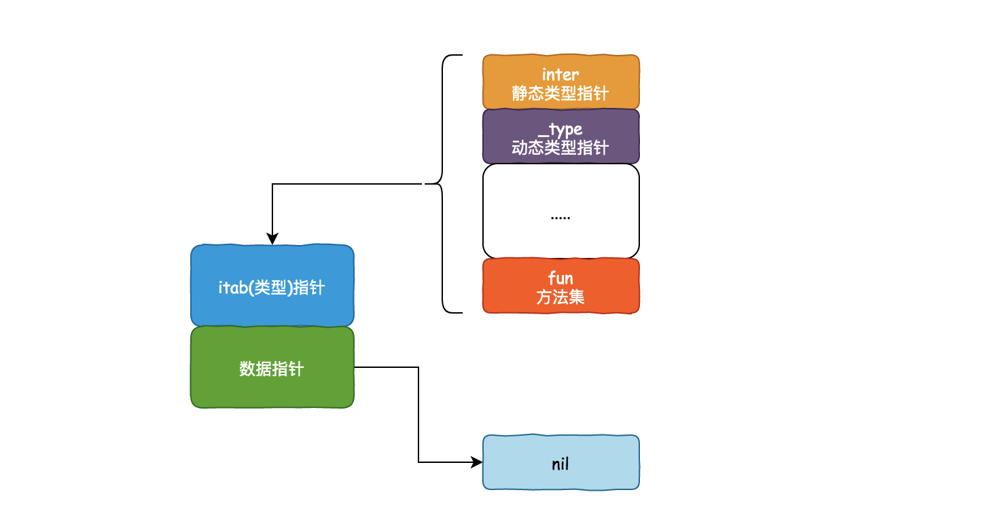
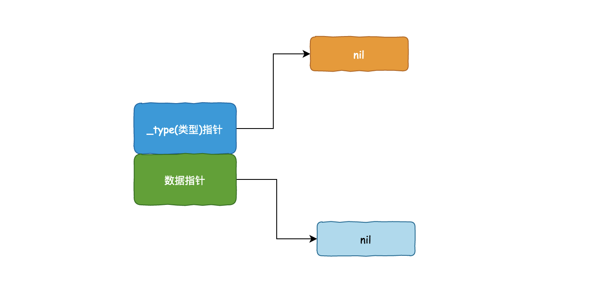
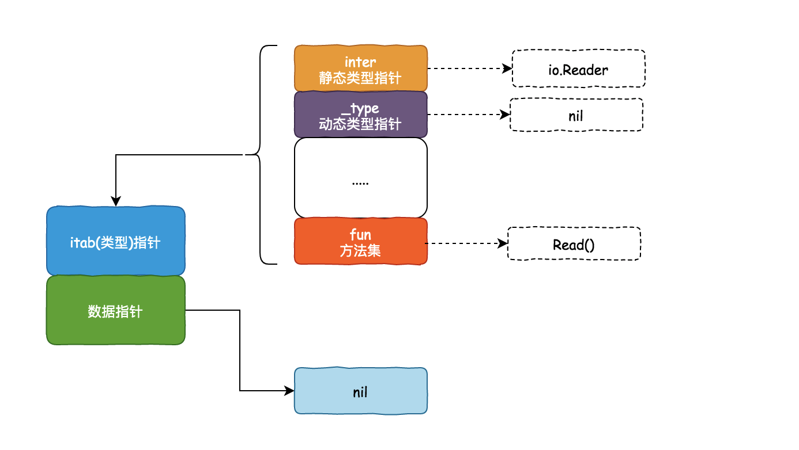
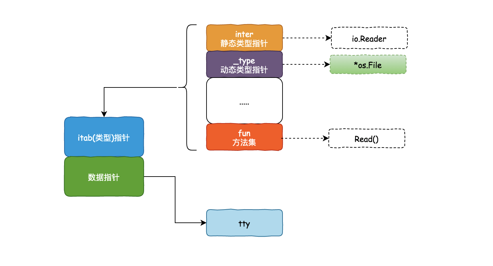
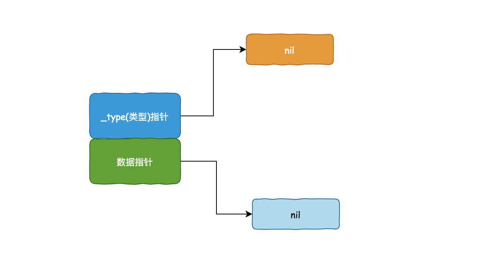
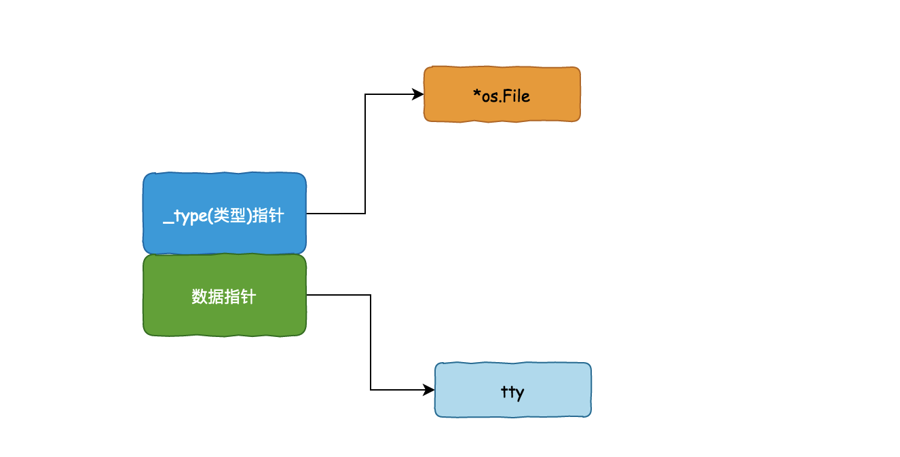

# 1.9.0、接口（interface）
接口（`interface`）定义了一个对象的行为规范，只定义规范不实现，由具体的对象来实现规范的细节。
在Go语言中接口（`interface`）是一种类型，一种抽象的类型。

`interface`是一组方法集(`method`)的集合，是duck-type programming的一种体现。但是这些方法不包含（实现）代码：它们没有被实现（它们是抽象的），接口里也不能包含变量。接口提供了一种方式来 说明 对象的行为：如果谁能搞定这件事，它就可以用在这儿。不关心属性（数据），只关心行为（方法）。

接口（interface）是调用方和实现方均需要遵守的一种约束，约束开发者按照统一的方法命名、参数类型、数量来处理具体业务。
实际上，接口就是一组没有实现的方法声明，到某个自定义类型要使用该方法时，根据具体情况把这些方法实现出来。

## 接口的定义
Go语言提倡面向接口编程。

每个接口由数个方法组成，接口的定义格式如下：
```
type 接口类型名 interface{
    方法名1( 参数列表1 ) 返回值列表1
    方法名2( 参数列表2 ) 返回值列表2
    …
}
```

其中：

- 接口名：使用`type`将接口定义为自定义的类型名。Go语言的接口在命名时，一般会在单词后面添加er，如有写操作的接口叫Writer，有字符串功能的接口叫 Stringer 等。接口名最好要能突出该接口的类型含义。还有一些不常用的方式（当后缀 er 不合适时），比如 Recoverable，此时接口名以 able 结尾，或者以 I 开头（像 .NET 或 Java 中那样）
- 方法名：当方法名首字母是大写且这个接口类型名首字母也是大写时，这个方法可以被接口所在的包（`package`）之外的代码访问。
- 参数列表、返回值列表：参数列表和返回值列表中的参数变量名可以省略。

举个例子：
```
type writer interface{
    Write([]byte) error
}
```

## 实现接口的条件
一个对象只要全部实现了接口中的方法，那么就实现了这个接口。换句话说，**接口就是一个需要实现的方法列表**。

举个例子，定义一个Sayer接口：
```
// Sayer 接口
type Sayer interface {
	say()
}
```
定义dog和cat两个结构体：
```
type dog struct {}

type cat struct {}
```


因为Sayer接口里只有一个say方法，所以我们只需要给dog和cat 分别实现say方法就可以实现Sayer接口了。

```
// dog实现了Sayer接口
func (d dog) say() {
	fmt.Println("汪汪汪")
}

// cat实现了Sayer接口
func (c cat) say() {
	fmt.Println("喵喵喵")
}
```
接口的实现就是这么简单，只要实现了接口中的所有方法，就实现了这个接口。

## 接口类型变量
接口类型变量能够存储所有实现了该接口的实例。 例如上面的示例中，Sayer类型的变量能够存储dog和cat类型的变量。

```
func main() {
	var x Sayer // 声明一个Sayer类型的变量x
	a := cat{}  // 实例化一个cat
	b := dog{}  // 实例化一个dog
	x = a       // 可以把cat实例直接赋值给x
	x.say()     // 喵喵喵
	x = b       // 可以把dog实例直接赋值给x
	x.say()     // 汪汪汪
}
```

## 值接收者和指针接收者实现接口的区别

举个例子：
有一个Mover接口和一个dog结构体。
```
type Mover interface {
	move()
}
type dog struct {}
```
###### 值接收者实现接口
```
func (d dog) move() {
	fmt.Println("狗会动")
}
```
此时实现接口的是dog类型：

```
func main() {
	var x Mover
	var wangcai = dog{} // 旺财是dog类型
	x = wangcai         // x可以接收dog类型
	var fugui = &dog{}  // 富贵是*dog类型
	x = fugui           // x可以接收*dog类型
	x.move()
}
```

从上面的代码中可以发现，使用值接收者实现接口之后，不管是dog结构体还是结构体指针`*dog`类型的变量都可以赋值给该接口变量。
因为Go语言中有对指针类型变量求值的语法糖，dog指针fugui内部会自动求值`*fugui`。

###### 指针接收者实现接口
同样的代码，再来测试一下使用指针接收者有什么区别：
```
func (d *dog) move() {
	fmt.Println("狗会动")
}
func main() {
	var x Mover
	var wangcai = dog{} // 旺财是dog类型
	x = wangcai         // x不可以接收dog类型
	var fugui = &dog{}  // 富贵是*dog类型
	x = fugui           // x可以接收*dog类型
}
```

此时实现Mover接口的是`*dog`类型，所以不能给x传入dog类型的wangcai，此时x只能存储*dog类型的值。
指向接口值的指针是非法的，它们不仅一点用也没有，还会导致代码错误。

## 类型与接口的关系

###### 一个类型实现多个接口
一个类型可以同时实现多个接口，而接口间彼此独立，不知道对方的实现。 

例如，狗可以叫，也可以动。分别定义Sayer接口和Mover接口，如下： Mover接口。
```
// Sayer 接口
type Sayer interface {
	say()
}

// Mover 接口
type Mover interface {
	move()
}
```

dog既可以实现Sayer接口，也可以实现Mover接口。
```
type dog struct {
	name string
}

// 实现Sayer接口
func (d dog) say() {
	fmt.Printf("%s会叫汪汪汪\n", d.name)
}

// 实现Mover接口
func (d dog) move() {
	fmt.Printf("%s会动\n", d.name)
}

func main() {
	var x Sayer
	var y Mover

	var a = dog{name: "旺财"}
	x = a
	y = a
	x.say()
	y.move()
}
```

###### 多个类型实现同一接口

Go语言中不同的类型还可以实现同一接口 

首先定义一个Mover接口，它要求必须由一个move方法。
```
// Mover 接口
type Mover interface {
	move()
}
```

例如狗可以动，汽车也可以动，可以使用如下代码实现这个关系：
```
type dog struct {
	name string
}

type car struct {
	brand string
}

// dog类型实现Mover接口
func (d dog) move() {
	fmt.Printf("%s会跑\n", d.name)
}

// car类型实现Mover接口
func (c car) move() {
	fmt.Printf("%s速度70迈\n", c.brand)
}
```

这个时候在代码中就可以把狗和汽车当成一个会动的物体来处理了，不再需要关注它们具体是什么，只需要调用它们的move方法就可以了。
```
func main() {
	var x Mover
	var a = dog{name: "旺财"}
	var b = car{brand: "保时捷"}
	x = a
	x.move()
	x = b
	x.move()
}
```

输出如下：
```
旺财会跑
保时捷速度70迈
```

并且一个接口的方法，不一定需要由一个类型完全实现，接口的方法可以通过在类型中嵌入其他类型或者结构体来实现。

```
// WashingMachine 洗衣机
type WashingMachine interface {
	wash()
	dry()
}

// 甩干器
type dryer struct{}

// 实现WashingMachine接口的dry()方法
func (d dryer) dry() {
	fmt.Println("甩一甩")
}

// 海尔洗衣机
type haier struct {
	dryer //嵌入甩干器
}

// 实现WashingMachine接口的wash()方法
func (h haier) wash() {
	fmt.Println("洗刷刷")
}
```

## 接口嵌套
接口与接口间可以通过嵌套创造出新的接口。
```
// Sayer 接口
type Sayer interface {
	say()
}

// Mover 接口
type Mover interface {
	move()
}

// 接口嵌套
type animal interface {
	Sayer
	Mover
}
```

嵌套得到的接口的使用与普通接口一样，这里我们让cat实现animal接口：

```
type cat struct {
	name string
}

func (c cat) say() {
	fmt.Println("喵喵喵")
}

func (c cat) move() {
	fmt.Println("猫会动")
}

func main() {
	var x animal
	x = cat{name: "花花"}
	x.move()
	x.say()
}
```
## 空接口

###### 空接口的定义
空接口是特殊形式的接口类型，普通的接口都有方法，而空接口没有定义任何方法的接口，也因此，我们可以说所有类型都至少实现了空接口。

格式如下：
```
type 接口类型名 interface {
}
```
每一个接口都包含两个属性，一个是值，一个是类型。

而对于空接口来说，这两者都是 `nil`，可以使用 `fmt` 来验证一下

```
package main

import (
    "fmt"
)

func main() {
    var i interface{}
    fmt.Printf("type: %T, value: %v", i, i)
}
```
输出如下：
```
type: <nil>, value: <nil>
```

空接口类型的变量可以存储任意类型的变量，所以通常会直接使用 `interface{}` 作为类型声明一个实例，而这个实例可以承载任意类型的值。
```
func main() {
	// 定义一个空接口x
	var x interface{}
	s := "Hello 沙河"
	x = s
	fmt.Printf("type:%T value:%v\n", x, x)
	i := 100
	x = i
	fmt.Printf("type:%T value:%v\n", x, x)
	b := true
	x = b
	fmt.Printf("type:%T value:%v\n", x, x)
}
```

###### 空接口的应用

**空接口作为函数的参数**
使用空接口实现可以接收任意类型的函数参数
```
// 空接口作为函数参数
func show(a interface{}) {
	fmt.Printf("type:%T value:%v\n", a, a)
}
```

**空接口作为map的值**

使用空接口实现可以保存任意值的字典。
```
// 空接口作为map值
	var studentInfo = make(map[string]interface{})
	studentInfo["name"] = "沙河娜扎"
	studentInfo["age"] = 18
	studentInfo["married"] = false
	fmt.Println(studentInfo)
```

###### 空接口需要注意的几个点：
1、空接口可以承载任意值，但不代表任意类型就可以承接空接口类型的值

从实现的角度看，任何类型的值都满足空接口。因此空接口类型可以保存任何值，也可以从空接口中取出原值。

但要是把一个空接口类型的对象，再赋值给一个固定类型（比如 `int`, `string`等类型）的对象赋值，是会报错的。

```
package main

func main() {
    // 声明a变量, 类型int, 初始值为1
    var a int = 1

    // 声明i变量, 类型为interface{}, 初始值为a, 此时i的值变为1
    var i interface{} = a

    // 声明b变量, 尝试赋值i
    var b int = i
}
```

这个报错，它就好比可以放进行礼箱的东西，肯定能放到集装箱里，但是反过来，能放到集装箱的东西就不一定能放到行礼箱了，在 Go 里就直接禁止了这种反向操作。
```
.\main.go:102:6: cannot use i (type interface {}) as type int in assignment: need type assertion
```

2、当空接口承载数组和切片后，该对象无法再进行切片
```
package main

import "fmt"

func main() {
    sli := []int{2, 3, 5, 7, 11, 13}

    var i interface{}
    i = sli

    g := i[1:3]
    fmt.Println(g)
}
```

输出如下：
```
# command-line-arguments
.\main.go:100:8: cannot slice i (type interface {})
```
3、在使用空接口来接收任意类型的参数时，它的静态类型是 `interface{}`，但动态类型（是 `int`，`string` 还是其他类型）并不知道，因此需要使用类型断言。

```
package main

import (
    "fmt"
)

func myfunc(i interface{})  {

    switch i.(type) {
    case int:
        fmt.Println("参数的类型是 int")
    case string:
        fmt.Println("参数的类型是 string")
    }
}

func main() {
    a := 10
    b := "hello"
    myfunc(a)
    myfunc(b)
}
```

输出如下：
```
参数的类型是 int
参数的类型是 string
```

## 类型断言
空接口可以存储任意类型的值，那该如何获取其存储的具体数据？

想要判断空接口中的值这个时候就可以使用类型断言，其语法格式：
```
x.(T)
```
其中：
- x：表示类型为`interface{}`的变量
- T：表示断言x可能是的类型。
这个表达式可以断言一个接口对象（x）里不是 nil，并且接口对象（x）存储的值的类型是 T。
该语法返回两个参数，第一个参数是x转化为T类型后的变量，第二个值是一个布尔值，若返回true则表示断言成功，返回false则表示断言失败。


类型断言的方式大体有两种方式：
第一种：
```
t := x.(T)
```
这个表达式可以断言一个接口对象（x）里不是 nil，并且接口对象（x）存储的值的类型是 T，如果断言成功，就会返回值给 t，如果断言失败，就会触发 `panic`。

举个例子：
```
package main

import "fmt"

func main() {
    var i interface{} = 10
    t1 := i.(int)
    fmt.Println(t1)

    fmt.Println("=====分隔线=====")

    t2 := i.(string)
    fmt.Println(t2)
}
```

运行后输出如下，可以发现在执行第二次断言的时候失败了，并且触发了 panic
```
10
=====分隔线=====
panic: interface conversion: interface {} is int, not string

goroutine 1 [running]:
main.main()
	E:/Code/Golang/workspase/src/golang-learnning-demo/main.go:104 +0x10e
```

如果要断言的接口值是 `nil`，来看看也是不是也如预期一样会触发`panic`
```
package main

func main() {
    var i interface{} // nil
    var _ = i.(interface{})
}
```

输出如下,确实是会 触发 `panic`：
```
panic: interface conversion: interface is nil, not interface {}

goroutine 1 [running]:
main.main()
	E:/Code/Golang/workspase/src/golang-learnning-demo/main.go:95 +0x34
```

第二种：
```
t, ok:= x.(T)
```
和上面一样，这个表达式也是可以断言一个接口对象（x）里不是 nil，并且接口对象（x）存储的值的类型是 T，如果断言成功，就会返回其类型给 t，并且此时 ok 的值 为 true，表示断言成功。

如果接口值的类型，并不是我们所断言的 T，就会断言失败，但和第一种表达式不同的事，这个不会触发 panic，而是将 ok 的值设为 false ，表示断言失败，此时t 为 T 的零值。

举个例子：
```
func main() {
	var x interface{}
	x = "Hello 北京"
	v, ok := x.(int)
	if ok {
		fmt.Println(v)
	} else {
		fmt.Println("类型断言失败")
	}
}
```

运行后输出如下，可以发现在执行断言的时候，虽然失败了，但并没有触发了 panic。
```
类型断言失败
```

###### Type Switch

如果需要区分多种类型，断言多次就需要写多个if判断，可以使用 type switch 断言，这个将会比一个一个进行类型断言更简单、直接、高效。

```
func justifyType(x interface{}) {
	switch v := x.(type) {
	case string:
		fmt.Printf("x is a string，value is %v\n", v)
	case int:
		fmt.Printf("x is a int is %v\n", v)
	case bool:
		fmt.Printf("x is a bool is %v\n", v)
	case nil:
        fmt.Println("x is a nil is %v\n", v)
	default:
		fmt.Println("unsupport type！")
	}
}
```

额外说明一下：
- 如果你的值是 `nil`，那么匹配的是 `case nil`
- 如果你的值在 `switch-case` 里并没有匹配对应的类型，那么走的是 default 分支


因为空接口可以存储任意类型值的特点，所以空接口在Go语言中的使用十分广泛。

关于接口需要注意的是，只有当有两个或两个以上的具体类型必须以相同的方式进行处理时才需要定义接口。

不要为了接口而写接口，那样只会增加不必要的抽象，导致不必要的运行时损耗。


此外，还有两点需要你格外注意：

- 类型断言，仅能对静态类型为空接口（`interface{}`）的对象进行断言，否则会抛出错误
- 类型断言完成后，实际上会返回静态类型为你断言的类型的对象，而要清楚原来的静态类型为空接口类型（`interface{}`），这是 Go 的隐式转换。


## 静态类型和动态类型

###### 接口值
一个接口的值（简称接口值）是由一个`具体类型`和`具体类型的值`两部分组成的。这两部分，分别称为`接口的动态类型`和`动态值`

举个例子：
```
var w io.Writer
w = os.Stdout
w = new(bytes.Buffer)
w = nil
```
请看下图分解：


**静态类型**

所谓的静态类型（即 `static type`），就是变量声明的时候的类型，它是你在编码时，肉眼可见的类型。
```
var age int   // int 是静态类型
var name string  // string 也是静态类型
```
**动态类型**
所谓的 动态类型（即 `concrete type`，也叫具体类型）是 程序运行时系统才能看见的类型。

这是什么意思呢？

我们都知道 空接口 可以承接任意类型的值，什么 int 呀，string 呀，都可以接收。

比如下面这几行代码
```
var i interface{}
i = 18
i = "北京"
```
第一行：给 i 声明了 `interface{}` 类型，所以 i 的静态类型就是 `interface{}`
第二行：给变量 i 赋一个 `int` 类型的值时，它的静态类型还是 `interface{}`，这是不会变的，但是它的动态类型此时变成了 `int` 类型。
第三行：给变量 i 赋一个 `string` 类型的值时，它的静态类型还是 `interface{}`，它还是不会变，但是它的动态类型此时又变成了 `string` 类型。

从以上，可以知道，不管是 i=18 ，还是 i="北京"，都是当程序运行到这里时，变量的类型，才发生了改变，这就是最开始所说的 **动态类型是程序运行时系统才能看见的类型**。

###### 接口细分
根据接口是否包含方法，可以将接口分为 `iface` 和 `eface`。

**iface**

第一种：iface，表示带有一组方法的接口。

比如：
```
type Phone interface {
   call()
}
```

iface 的具体结构可用如下一张图来表示




iface 的源码如下：
```
// runtime/runtime2.go
// 非空接口
type iface struct {
    tab  *itab
    data unsafe.Pointer
}

// 非空接口的类型信息
type itab struct {
    inter  *interfacetype  // 接口定义的类型信息
    _type  *_type      // 接口实际指向值的类型信息
    link   *itab
    bad    int32
    inhash int32
    fun    [1]uintptr   // 接口方法实现列表，即函数地址列表，按字典序排序
}

// runtime/type.go
// 非空接口类型，接口定义，包路径等。
type interfacetype struct {
   typ     _type
   pkgpath name
   mhdr    []imethod      // 接口方法声明列表，按字典序排序
}
// 接口的方法声明
type imethod struct {
   name nameOff          // 方法名
   ityp typeOff                // 描述方法参数返回值等细节
}
```

**eface**

第二种：eface，表示不带有方法的接口


比如
```
//空接口
var i interface{}
```

eface 的源码如下：
```
// src/runtime/runtime2.go
// 空接口
type eface struct {
    _type *_type
    data  unsafe.Pointer
}
```
eface 的具体结构可用如下一张图来表示


###### 理解动态类型

给一个空接口类型的变量赋值时，接口的内部结构会发生怎样的变化？
**iface**

先来看看 iface，有如下一段代码：
```
var reader io.Reader

tty, err := os.OpenFile("/dev/tty", os.O_RDWR, 0)
if err != nil {
    return nil, err
}

reader = tty
```

第一行代码：var reader io.Reader ，由于 io.Reader 接口包含 Read 方法，所以 io.Reader 是 iface，此时 reader 对象的静态类型是 io.Reader，暂无动态类型。


最后一行代码：reader = tty，tty 是一个 `*os.File` 类型的实例，此时reader 对象的静态类型还是 io.Reader，而动态类型变成了 *os.File。



**eface**

再来看看 eface，有如下一段代码：
```
//不带函数的interface
var empty interface{}

tty, err := os.OpenFile("/dev/tty", os.O_RDWR, 0)
if err != nil {
    return nil, err
}

empty = tty
```

第一行代码：var empty interface{}，由于 `interface{}` 是一个 eface，其只有一个 `_type` 可以存放变量类型，此时 empty 对象的（静态）类型是 nil



最后一行代码：empty = tty，tty 是一个 `*os.File` 类型的实例，此时 _type 变成了 *os.File。


由于动态类型的存在，在一个函数中接收的参数的类型有可能无法预先知晓，此时就要对参数进行反射，然后根据不同的类型做不同的处理。

## 接口的三个“潜规则”
###### 对方法的调用限制

接口是一组固定的方法集，由于静态类型的限制，接口变量有时仅能调用其中特定的一些方法。

请看下面这段代码
```
package main

import "fmt"

type Phone interface {
    call()
}

type iPhone struct {
    name string
}

func (phone iPhone)call()  {
    fmt.Println("Hello, iPhone.")
}

func (phone iPhone)send_wechat()  {
    fmt.Println("Hello, Wechat.")
}

func main() {
    var phone Phone
    phone = iPhone{name:"ming's iphone"}
    phone.call()
    phone.send_wechat()
}
```


定义一个 Phone 的接口，只要求实现 call 方法即可，也就是只要能打电话的设备就是一个电话（好像是一句没用的废话）。

然后再定义了一个 iPhone 的结构体，该结构体接收两个方法，一个是打电话（ call 函数），一个是发微信（send_wechat 函数）。

最后一步是关键，定义一个 Phone 接口类型的 phone 对象，该对象的内容是 iPhone 结构体。然后调用该对象的 call 方法，一切正常。

但是在调用 phone.send_wechat方法的时候，程序会报错，提示Phone 类型的方法没有 send_wechat 的字段或方法：
```
# command-line-arguments
.\main.go:115:7: phone.send_wechat undefined (type Phone has no field or method send_wechat)
```

原因也很明显，因为phone对象显示声明为 Phone 接口类型，因此 phone调用的方法会受到此接口的限制。

那么如何让 phone 可以调用 send_wechat 方法呢？

答案是可以不显示的声明为 Phone接口类型 ，但要清楚 phone 对象实际上是隐式的实现了 Phone 接口，如此一来，方法的调用就不会受到接口类型的约束。

修改 main 方法成如下：
```
func main() {
    phone := iPhone{name:"ming's iphone"}
    phone.call()
    phone.send_wechat()
}
```
输出如下：
```
Hello, iPhone.
Hello, Wechat.
```
一切正常，不再报错

###### 调用函数时的隐式转换
Go 语言中的函数调用默认都是值传递的，变量会在方法调用前进行类型转换。

比如下面这段代码：
```
import (
    "fmt"
)

func printType(i interface{})  {

    switch i.(type) {
    case int:
        fmt.Println("参数的类型是 int")
    case string:
        fmt.Println("参数的类型是 string")
    }
}

func main() {
    a := 10
    printType(a)
}
```

运行后，一切正常，输出如下：
```
参数的类型是 int
```

但是把函数内的内容搬到到外面来
```
package main

import "fmt"


func main() {
    a := 10

    switch a.(type) {
    case int:
        fmt.Println("参数的类型是 int")
    case string:
        fmt.Println("参数的类型是 string")
    }
}
```

就会出现报错：
```
# command-line-arguments
.\main.go:131:9: cannot type switch on non-interface value a (type int)
```
可是，代码逻辑都是一样的，为什么一个不会报错，一个会报错呢？

原因其实很简单。

当一个函数接口 `interface{}` 空接口类型时，它可以接收什么任意类型的参数。

在使用这种写法时，Go 会默默地做一件事，就是把传入函数的参数值（注意：Go 语言中的函数调用都是值传递的）的类型隐式的转换成 `interface{}` 类型。

**如何进行接口类型的显示转换**

如果你想手动对其进行类型转换，可以像下面这样子，就可以将变量 a 的静态类型转换为 interface{} 类型然后赋值给 b （此时 a 的静态类型还是 int，而 b 的静态类型为 `interface{}`）

```
var a int = 25
b := interface{}(a)
```

知道了方法后，将代码修改成如下：
```
package main

import "fmt"

func main() {
    a := 10

    switch interface{}(a).(type) {
    case int:
        fmt.Println("参数的类型是 int")
    case string:
        fmt.Println("参数的类型是 string")
    }
}
```
运行后，一切正常。

```
参数的类型是 int
```

